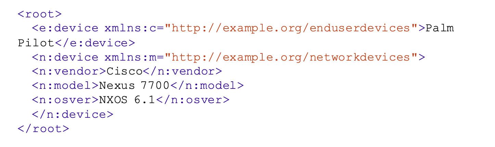
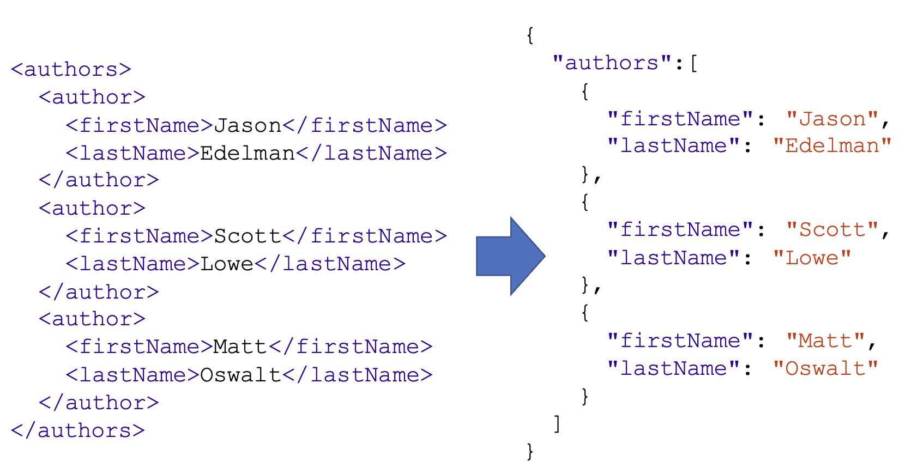
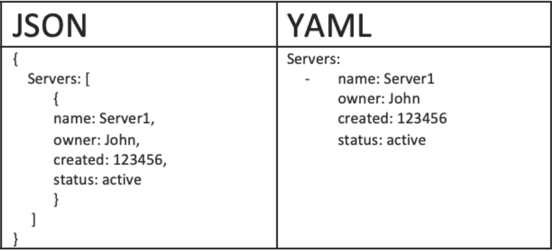

# DevOps

## Table of Contents

- [Data Formats](#data-formats)
  - [XML](#xml)
  - [JSON](#json)
  - [YAML](#yaml)

## Data Formats

We need a standard format to allow a diverse set of software to communicate with each other, and for humans to interface with it. All of the data formats that we’ll discuss in this chapter have broad support over a multitude of languages and operating systems.

- XML - machine to machine
- JSON - machine to machine
- YAML – human to machine

### XML

XML is a markup language that defines a set of rules for encoding documents in a format that is both human-readable and machine-readable. The design goals of XML emphasize simplicity, generality, and usability across the Internet.

#### Features

- XML files end in `.xml`
- Root, children nodes, attributes
- Namespaces (Used to resolve naming conflicts)



#### Benefits

- Support inter-business transactions
- Maintain data integrity
  - Verify data accuracy
  - Automatically customize data presentation for different users
  - Store data consistently across multiple platforms
- Improve search efficiency
- Design flexible applications

### JSON

JSON (JavaScript Object Notation) is a lightweight data-interchange format. It is easy for humans to read and write. It is easy for machines to parse and generate.

#### Features

- JSON files end in `.json`
- The whole thing is wrapped in curly braces {}. This is very common, and it indicates that JSON objects are contained inside
- Think of “objects” as key-value pairs, or dictionaries
- JSON objects always use string values when describing the keys
- JSON list indicated by the square brackets []
- Data Types:
  - Number
  - String
  - Boolean
  - Array
  - Object
  - Null



#### Working with JSON in Python

- JSON enjoys wide support across a myriad of languages
- You will often be able to simply import a JSON data structure into constructs of a given language, simply with a one-line command

```python
import json

item = {
    "name": "egg",
    "price": 0.99,
}

with open('data.json', 'w') as f:
    json.dump(item, f) # write python object to json file

with open('data.json', 'r') as f:
    data = json.load(f) # load json data into python object

print(data) # {'name': 'egg', 'price': 0.99}
```

### YAML

YAML (YAML Ain't Markup Language) is a human-readable data serialization language. It is commonly used for configuration files, automation workflow, or providing a data set
to work with.

#### Features

- YAML files end in `.yaml` or `.yml`
- YAML is a superset of JSON
- YAML is a human-readable data serialization language
- YAML is a strict indentation language
- YAML is case sensitive



#### Working with YAML in Python

```python
import yaml

item = {
    "name": "egg",
    "price": 0.99,
}

with open('data.yaml', 'w') as f:
    yaml.dump(item, f) # write python object to yaml file

with open('data.yaml', 'r') as f:
    data = yaml.load(f, Loader=yaml.FullLoader) # load yaml data into python object

print(data) # {'name': 'egg', 'price': 0.99}
```

Note: The yaml module is not part of the standard library, so you’ll need to install it first. You can do so with pip:

```bash
pip install pyyaml
```
