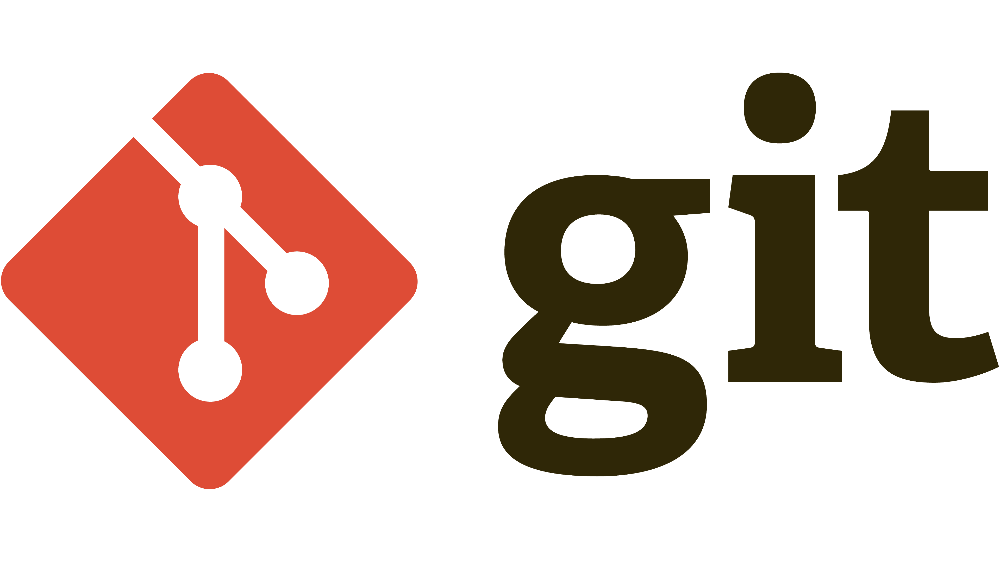
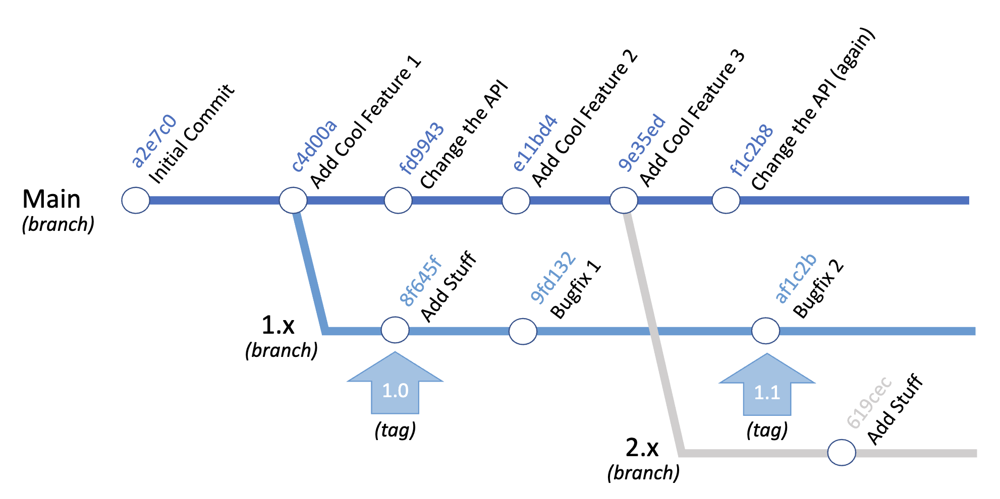
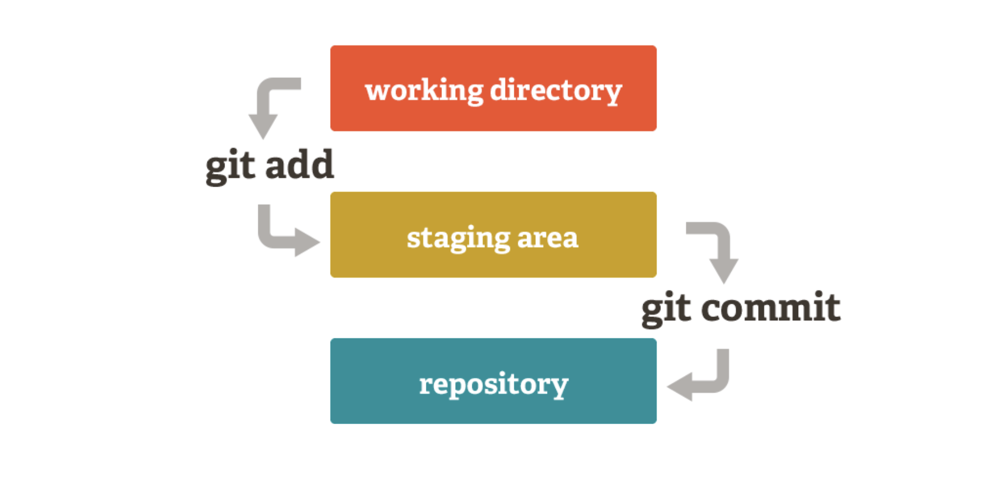
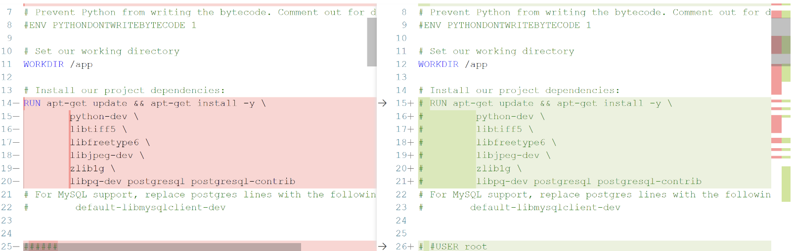
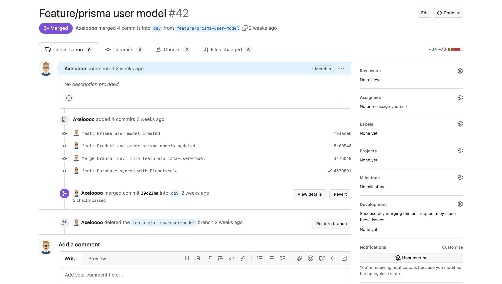
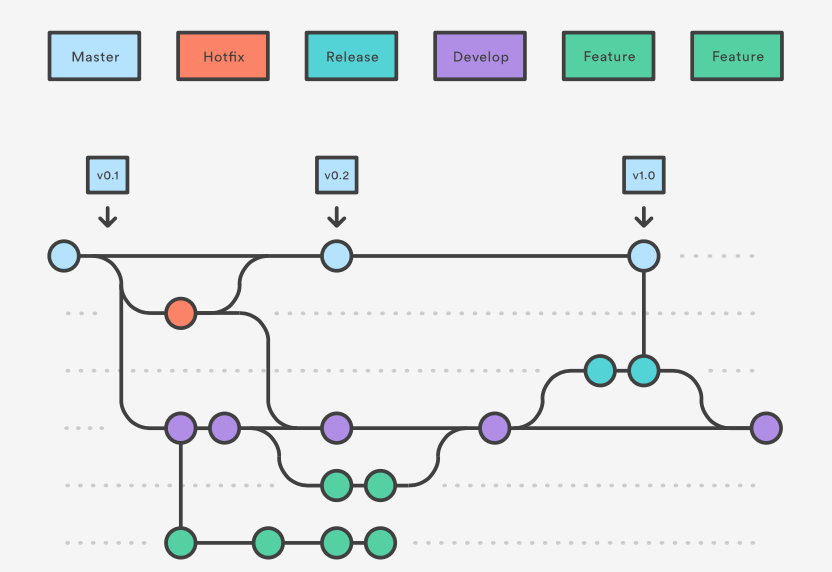
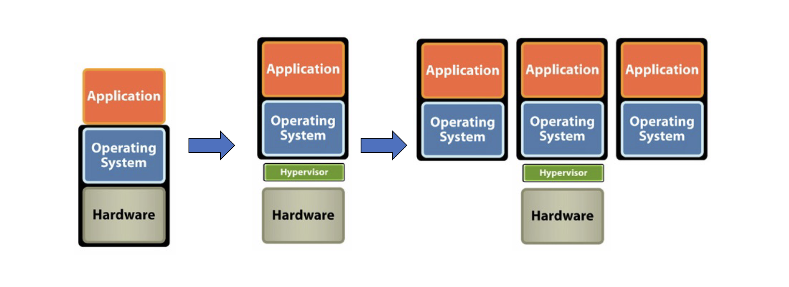

# DevOps

---

## Table of Contents

- [Data Formats](#data-formats)
  - [XML](#xml)
  - [JSON](#json)
  - [YAML](#yaml)
- [Git](#git)
  - [Setting Up Git](#setting-up-git)
  - [Commit](#commit)
  - [Tag](#tag)
  - [Branch](#branch)
  - [Terminology](#terminology)
  - [Distributed Version Control System](#distributed-version-control-system)
  - [Setting Up A Repository](#setting-up-a-repository)
  - [Inspecting A Repository](#inspecting-a-repository)
  - [Undoing Commits And Changes](#undoing-commits-and-changes)
  - [Pull Requests](#pull-requests)
  - [Merge](#merge)
  - [Branch Workflow](#branch-workflow)
- [Virtualization](#virtualization)
  - [Hardware Virtualization](#hardware-virtualization)
  - [Terminology](#terminology)
  - [Advantages](#advantages)

---

## Data Formats

We need a standard format to allow a diverse set of software to communicate with each other, and for humans to interface with it. All of the data formats that we’ll discuss in this chapter have broad support over a multitude of languages and operating systems.

- XML - machine to machine
- JSON - machine to machine
- YAML – human to machine

### XML

XML is a markup language that defines a set of rules for encoding documents in a format that is both human-readable and machine-readable. The design goals of XML emphasize simplicity, generality, and usability across the Internet.

#### Features

- XML files end in `.xml`
- Root, children nodes, attributes
- Namespaces (Used to resolve naming conflicts)


#### Benefits

- Support inter-business transactions
- Maintain data integrity
  - Verify data accuracy
  - Automatically customize data presentation for different users
  - Store data consistently across multiple platforms
- Improve search efficiency
- Design flexible applications

### JSON

JSON (JavaScript Object Notation) is a lightweight data-interchange format. It is easy for humans to read and write. It is easy for machines to parse and generate.

#### Features

- JSON files end in `.json`
- The whole thing is wrapped in curly braces {}. This is very common, and it indicates that JSON objects are contained inside
- Think of “objects” as key-value pairs, or dictionaries
- JSON objects always use string values when describing the keys
- JSON list indicated by the square brackets []
- Data Types:
  - Number
  - String
  - Boolean
  - Array
  - Object
  - Null


#### Working with JSON in Python

- JSON enjoys wide support across a myriad of languages
- You will often be able to simply import a JSON data structure into constructs of a given language, simply with a one-line command

```python
import json

item = {
    "name": "egg",
    "price": 0.99,
}

with open('data.json', 'w') as f:
    json.dump(item, f) # write python object to json file

with open('data.json', 'r') as f:
    data = json.load(f) # load json data into python object

print(data) # {'name': 'egg', 'price': 0.99}
```

### YAML

YAML (YAML Ain't Markup Language) is a human-readable data serialization language. It is commonly used for configuration files, automation workflow, or providing a data set
to work with.

#### Features

- YAML files end in `.yaml` or `.yml`
- YAML is a superset of JSON
- YAML is a human-readable data serialization language
- YAML is a strict indentation language
- YAML is case sensitive


#### Working with YAML in Python

```python
import yaml

item = {
    "name": "egg",
    "price": 0.99,
}

with open('data.yaml', 'w') as f:
    yaml.dump(item, f) # write python object to yaml file

with open('data.yaml', 'r') as f:
    data = yaml.load(f, Loader=yaml.FullLoader) # load yaml data into python object

print(data) # {'name': 'egg', 'price': 0.99}
```

Note: The yaml module is not part of the standard library, so you’ll need to install it first. You can do so with pip:

```bash
pip install pyyaml
```

---

## Git



Source code management systems are essential for any software development project. They allow you to keep track of your software at the source level. You can track changes, revert to previous stages, and work on different branches at the same time. Code is organized within a repository.

### Setting Up Git

```bash
git config --global user.name <name>    # Set user name

git config --global user.email <email>  # Set user email
```

### Commit

- Specific snapshot within the development tree.
- Collection of changes applied to a project's files.
- Metadata about the change.
- Identified by a unique `SHA-1 Hash`.

```bash
git commit -m "Add new feature"   # Commit changes

git show 5b8e4f                   # Show commit details
```

### Tag

- Represents a single commit.
- Often human-friendly.
- Version number.

```bash
git tag v1.0.0    # Create a tag

git tag           # List all tags

git show v1.0.0   # Show tag details
```

### Branch

- A history of successive changes to code.
- A new branch may be created at any time, from any existing commit.
- May represent versions of code.

```bash
git branch                        # List all branches

git branch feature/add-btn        # Create a new branch

git checkout feature/add-btn      # Switch to a branch

git checkout -b feature/add-btn   # Create and switch to a branch
```



### Terminology

- **Working Files**: Files that are currently on your file system.
- **Staging Area**: Files that are ready to be committed. Only files that have been staged will be committed.
- **Checkout**: Replace the current directory files with those from a specific branch or commit.



### Distributed Version Control System

- **Clone**: Creates a full copy of repository on your local machine.
- **Fetch**: Update your local repository with changes from non-local repositories (i.e. GitHub).
- **Fork**: Create a copy of a repository in a remote location (i.e. GitHub).

```bash
git clone https://github.com/username/repo.git   # Clone a repository

git fetch origin                                # Fetch changes from remote repository
```

### Setting Up A Repository

- Create a new repository from cero on the command line

```bash
git init                                                    # Initialize a new repository

git remote add origin https://github.com/username/repo.git  # Add a remote repository
```

- Clone an existing repository

```bash
git clone https://github.com/username/repo.git    # Clone a repository

cd repo                                           # Change directory to the repository
```

### Inspecting A Repository

- **git diff**: Show changes between commits, commit and working tree, etc.
- **git status**: Display the state of the working directory and the staging area.
- **git blame**: Examine the history of a file and get context as to who made changes and when.
- **git log**: Show commit logs.

```bash
git diff ./file.txt    # Show changes between commits, commit and working tree, etc.

git status            # Display the state of the working directory and the staging area

git blame ./file.txt  # Examine the history of a file

git log               # Show commit logs
```



### Undoing Commits And Changes

- **git revert**: Create a new commit that undoes the changes from a previous commit.
- **git commit --amend**: Change the last commit.
- **git reset --soft**: Only resets the HEAD to the commit you specified.
- **git reset --mixed**: Resets the HEAD to the commit you specified and resets the staging area.
- **git reset --hard**: Resets the HEAD to the commit you specified and resets the staging area and working directory.

```bash
git revert 5b8e4f    # Create a new commit that undoes the changes from a previous commit

git commit --amend   # Change the last commit

git reset --soft 5b8e4f    # Only resets the HEAD to the commit you specified

git reset --mixed 5b8e4f   # Resets the HEAD to the commit you specified and resets the staging area

git reset --hard 5b8e4f    # Resets the HEAD to the commit you specified and resets the staging area and working directory
```

### Pull Requests

Pull requests are a mechanism for a developer to notify team members that they have completed a feature. Once their feature branch is ready, the developer files a pull request via their SCM (Source Control Management) system. This allows team members to review the changes and discuss any potential modifications.



### Merge

A merge is the act of integrating the changes from one branch or commit into a second branch. The result is a new commit that is a combination of the two. If a merge fails, git will notify you with a merge conflict. Merge conflixts must be fixed manually, and then added and committed.

**NOTE**: Merge conflicts occur when two branches have changed the same part of the same file, and then those branches are merged together. Git will not be able to automatically determine what the correct content should be or if both changes should be included, so you must inspect and resolve the conflict manually.

```bash
git merge feature/add-btn    # Merge a branch into the current branch
```

### Branch Workflow

Feature branching is a git workflow that allows multiple developers to work on a particular feature in isolation. Each feature is developed in a dedicated branch, and once it is ready, it is merged into the main branch.



---

## Virtualization



### Hardware Virtualization

- Abstract underlying physical hardware from operating systems and applications.
- Allows multiple guest operating systems to run in parallel.
- Physical resources are shared among all guest OS and virtualization software.

### Terminology

- **Host OS/Host Machine**: Physical hardware/server.
- **Hypervisor**: The virtualization software, acts as the true OS for the server.
- **Guest OS/Virtual Machines**: Instances of the virtualized OS, running in emulated environments. Guest thinks it’s running on real hardware.

### Advantages

- **Sandbox**: Isolated from the host OS.
- **Networked**: Access over the network.
- **Portable**: Run on any host OS.
- **Snapshots**: Saved and restored to previous states.

---

## Docker

---
