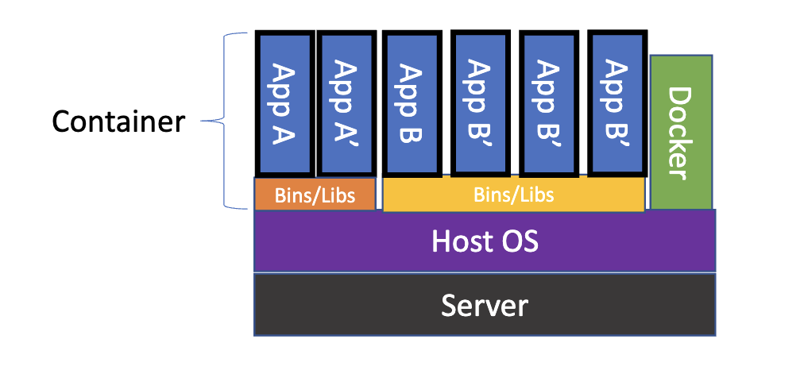

# DevOps

---

## Table of Contents

- [Data Formats](#data-formats)
  - [XML](#xml)
  - [JSON](#json)
  - [YAML](#yaml)
- [Git](#git)
  - [Setting Up Git](#setting-up-git)
  - [Commit](#commit)
  - [Tag](#tag)
  - [Branch](#branch)
  - [Terminology](#terminology)
  - [Distributed Version Control System](#distributed-version-control-system)
  - [Setting Up A Repository](#setting-up-a-repository)
  - [Inspecting A Repository](#inspecting-a-repository)
  - [Undoing Commits And Changes](#undoing-commits-and-changes)
  - [Pull Requests](#pull-requests)
  - [Merge](#merge)
  - [Branch Workflow](#branch-workflow)
- [Virtualization](#virtualization)
  - [Hardware Virtualization](#hardware-virtualization)
  - [Terminology](#terminology)
  - [Advantages](#advantages)
- [Docker](#docker)
  - [Benefits](#benefits)
  - [Containers vs VMs](#containers-vs-vms)
  - [Basic Docker Workflow](#basic-docker-workflow)
  - [Image](#image)
  - [Container](#container)
  - [Image vs Container](#image-vs-container)
  - [Dockerfile](#dockerfile)
  - [Mount Volumes](#mount-volumes)
  - [Publish Port](#publish-port)
  - [Docker Compose](#docker-compose)
- [Portainer](#portainer)
  - [Installation](#installation)
- [Ansible](#ansible)
  - [SSH Or WinRM](#ssh-or-winrm)
  - [Inventory](#inventory)
  - [Playbook](#playbook)
  - [Task](#task)
  - [Role](#role)
  - [Facts](#facts)
  - [Modules](#modules)
  - [Variables](#variables)
- [Terraform](#terraform)
  - [Configuration](#configuration)
  - [Commands](#commands)
  - [Local State](#local-state)
  - [Remote State](#remote-state)
  - [Plan / Apply](#plan--apply)
  - [Terraform Variables](#terraform-variables)

---

## Data Formats

We need a standard format to allow a diverse set of software to communicate with each other, and for humans to interface with it. All of the data formats that we’ll discuss in this chapter have broad support over a multitude of languages and operating systems.

- **XML** - machine to machine

- **JSON** - machine to machine

- **YAML** – human to machine

### XML

XML is a markup language that defines a set of rules for encoding documents in a format that is both human-readable and machine-readable. The design goals of XML emphasize simplicity, generality, and usability across the Internet.

#### Features

- XML files end in `.xml`.

- Root, children nodes, attributes.

- Namespaces (Used to resolve naming conflicts).


#### Benefits

- Support inter-business transactions.

- Maintain data integrity.

  - Verify data accuracy.
  - Automatically customize data presentation for different users.
  - Store data consistently across multiple platforms.

- Improve search efficiency.

- Design flexible applications.

### JSON

JSON (JavaScript Object Notation) is a lightweight data-interchange format. It is easy for humans to read and write. It is easy for machines to parse and generate.

#### Features

- JSON files end in `.json`.

- The whole thing is wrapped in curly braces {}. This is very common, and it indicates that JSON objects are contained inside.

- Think of “objects” as key-value pairs, or dictionaries.

- JSON objects always use string values when describing the keys.

- JSON list indicated by the square brackets [].

- Data Types:
  - Number
  - String
  - Boolean
  - Array
  - Object
  - Null


#### Working with JSON in Python

- JSON enjoys wide support across a myriad of languages
- You will often be able to simply import a JSON data structure into constructs of a given language, simply with a one-line command

```python
import json

item = {
    "name": "egg",
    "price": 0.99,
}

with open("data.json", "w") as f:
    json.dump(item, f) # write python object to json file

with open("data.json", "r") as f:
    data = json.load(f) # load json data into python object

print(data) # {"name": "egg", "price": 0.99}
```

### YAML

YAML (YAML Ain't Markup Language) is a human-readable data serialization language. It is commonly used for configuration files, automation workflow, or providing a data set
to work with.

#### Features

- YAML files end in `.yaml` or `.yml`.

- YAML is a superset of JSON.

- YAML is a human-readable data serialization language.

- YAML is a strict indentation language.

- YAML is case sensitive.


#### Working with YAML in Python

```python
import yaml

item = {
    "name": "egg",
    "price": 0.99,
}

with open("data.yaml", "w") as f:
    yaml.dump(item, f) # write python object to yaml file

with open("data.yaml", "r") as f:
    data = yaml.load(f) # load yaml data into python object

print(data) # {"name": "egg", "price": 0.99}
```

_**Note**: The yaml module is not part of the standard library, so you’ll need to install it first. You can do so with pip:_

```bash
pip install pyyaml
```

---

## Git


Source code management systems are essential for any software development project. They allow you to keep track of your software at the source level. You can track changes, revert to previous stages, and work on different branches at the same time. Code is organized within a repository.

### Setting Up Git

```bash
git config --global user.name <name>    # Set user name

git config --global user.email <email>  # Set user email
```

### Commit

- Specific snapshot within the development tree.

- Collection of changes applied to a project's files.

- Metadata about the change.

- Identified by a unique `SHA-1 Hash`.

```bash
git commit -m "Add new feature"   # Commit changes

git show 5b8e4f                   # Show commit details
```

### Tag

- Represents a single commit.

- Often human-friendly.

- Version number.

```bash
git tag v1.0.0    # Create a tag

git tag           # List all tags

git show v1.0.0   # Show tag details
```

### Branch

- A history of successive changes to code.

- A new branch may be created at any time, from any existing commit.

- May represent versions of code.

```bash
git branch                        # List all branches

git branch feature/add-btn        # Create a new branch

git checkout feature/add-btn      # Switch to a branch

git checkout -b feature/add-btn   # Create and switch to a branch
```


### Terminology

- **Working Files**: Files that are currently on your file system.

- **Staging Area**: Files that are ready to be committed. Only files that have been staged will be committed.

- **Checkout**: Replace the current directory files with those from a specific branch or commit.


### Distributed Version Control System

- **Clone**: Creates a full copy of repository on your local machine.

- **Fetch**: Update your local repository with changes from non-local repositories (i.e. GitHub).

- **Fork**: Create a copy of a repository in a remote location (i.e. GitHub).

```bash
git clone https://github.com/username/repo.git   # Clone a repository

git fetch origin                                # Fetch changes from remote repository
```

### Setting Up A Repository

- Create a new repository from cero on the command line

```bash
git init                                                    # Initialize a new repository

git remote add origin https://github.com/username/repo.git  # Add a remote repository
```

- Clone an existing repository

```bash
git clone https://github.com/username/repo.git    # Clone a repository

cd repo                                           # Change directory to the repository
```

### Inspecting A Repository

- **git diff**: Show changes between commits, commit and working tree, etc.

- **git status**: Display the state of the working directory and the staging area.

- **git blame**: Examine the history of a file and get context as to who made changes and when.

- **git log**: Show commit logs.

```bash
git diff ./file.txt    # Show changes between commits, commit and working tree, etc.

git status            # Display the state of the working directory and the staging area

git blame ./file.txt  # Examine the history of a file

git log               # Show commit logs
```


### Undoing Commits And Changes

- **git revert**: Create a new commit that undoes the changes from a previous commit.

- **git commit --amend**: Change the last commit.

- **git reset --soft**: Only resets the HEAD to the commit you specified.

- **git reset --mixed**: Resets the HEAD to the commit you specified and resets the staging area.

- **git reset --hard**: Resets the HEAD to the commit you specified and resets the staging area and working directory.

```bash
git revert 5b8e4f    # Create a new commit that undoes the changes from a previous commit

git commit --amend   # Change the last commit

git reset --soft 5b8e4f    # Only resets the HEAD to the commit you specified

git reset --mixed 5b8e4f   # Resets the HEAD to the commit you specified and resets the staging area

git reset --hard 5b8e4f    # Resets the HEAD to the commit you specified and resets the staging area and working directory
```

### Pull Requests

Pull requests are a mechanism for a developer to notify team members that they have completed a feature. Once their feature branch is ready, the developer files a pull request via their SCM (Source Control Management) system. This allows team members to review the changes and discuss any potential modifications.


### Merge

A merge is the act of integrating the changes from one branch or commit into a second branch. The result is a new commit that is a combination of the two. If a merge fails, git will notify you with a merge conflict. Merge conflixts must be fixed manually, and then added and committed.

**NOTE**: Merge conflicts occur when two branches have changed the same part of the same file, and then those branches are merged together. Git will not be able to automatically determine what the correct content should be or if both changes should be included, so you must inspect and resolve the conflict manually.

```bash
git merge feature/add-btn    # Merge a branch into the current branch
```

### Branch Workflow

Feature branching is a git workflow that allows multiple developers to work on a particular feature in isolation. Each feature is developed in a dedicated branch, and once it is ready, it is merged into the main branch.


---

## Virtualization


### Hardware Virtualization

- Abstract underlying physical hardware from operating systems and applications.

- Allows multiple guest operating systems to run in parallel.

- Physical resources are shared among all guest OS and virtualization software.

### Terminology

- **Host OS/Host Machine**: Physical hardware/server.

- **Hypervisor**: The virtualization software, acts as the true OS for the server.

- **Guest OS/Virtual Machines**: Instances of the virtualized OS, running in emulated environments. Guest thinks it’s running on real hardware.

### Advantages

- **Sandbox**: Isolated from the host OS.

- **Networked**: Access over the network.

- **Portable**: Run on any host OS.

- **Snapshots**: Saved and restored to previous states.

---

## Docker


Docker is a platform for developers and sysadmins to develop, deploy, and run applications with containers. The use of Linux containers to deploy applications is called containerization.

### Benefits

- **Flexible**: Even the most complex applications can be containerized.

- **Lightweight**: Containers leverage and share the host kernel.

- **Interchangeable**: You can deploy updates and upgrades on-the-fly.

- **Portable**: You can build locally, deploy to the cloud, and run anywhere.

- **Scalable**: You can increase and automatically distribute container replicas.

- **Stackable**: You can stack services vertically and on-the-fly.

### Containers vs VMs

Container are isolated, but share OS and, where appropriate, bins/libraries. VMs are isolated, but each has its own OS, bins, and libraries. This results in significantly faster deployment, much less overhead, easier migration and faster restart.



### Basic Docker Workflow


### Image

Persisted snapshot that can be run as a container.

- **images**: List all local images.

- **run**: Create a container from an image and execute a command in it.

- **tag**: Tag an image.

- **pull**: Download an image from a registry.

- **rmi**: Delete a local image.

```bash
docker images                     # List all local images

docker run -it ubuntu /bin/bash   # Create a container from an image and execute a command in it

docker tag ubuntu my-ubuntu       # Tag an image

docker pull ubuntu                # Download an image from a registry

docker rmi ubuntu                 # Delete a local image
```

### Container

Runnable instance of an image.

- **ps**: List all running containers.

- **ps -a**: List all containers (running and stopped).

- **top**: Display processes of a container.

- **start**: Start a stopped container.

- **stop**: Stop a running container.

- **pause**: Pause all processes within a container.

- **rm**: Delete a container.

- **commit**: Create an image from a container.

```bash
docker ps                      # List all running containers

docker ps -a                   # List all containers (running and stopped)

docker top <container_id>      # Display processes of a container

docker start <container_id>    # Start a stopped container

docker stop <container_id>     # Stop a running container

docker pause <container_id>    # Pause all processes within a container

docker rm <container_id>       # Delete a container
```

### Image vs Container


### Dockerfile

Dockerfile is a text document that contains all the commands a user could call on the command line to assemble an image. Can be versioned in a version control system like Git or
SVN, along with all dependencies. Docker Hub can automatically build images based on
dockerfiles on Github WorkFlows.

- Configuration is done in a `Dockerfile`.

```Dockerfile
FROM ubuntu
ENV DOCK_MESSAGE Hello My World
ADD dir /files
CMD ["bash", "echo $DOCK_MESSAGE"]
```

The above `Dockerfile` will create an image from the `ubuntu` image, set an environment variable, add a directory to the image, and run a command.

- Run the following commands to build and run the image:

```bash
docker build .              # Build an image from a Dockerfile

docker inspect <image_id>   # Return low-level information on Docker objects
```

### Mount Volumes

Volumes allow data to persist beyond the lifetime of a container.

```bash
docker run -it -v /hostLog:/log ubuntu  # Mount a volume to a container
```

Run a second container, volume can be shared between containers.

```bash
docker run -it --volumes-from <container_id> ubuntu  # Mount a volume from another container
```

### Publish Port

Port mapping allows a container to expose a port to the host.

```bash
docker run -p 8080:80 nginx  # Publish a container's port to the host
```

This will allow you to access the container's port 80 from the host's port 8080.

- `8080` Host Port (computer running the container)

- `80` Container Port (inside the container)

You can link containers together, so that they can communicate with each other.

```bash
docker run --link <container_id>:<alias> <image>  # Link a container to another container
```

### Docker Compose

Docker Compose is a tool for defining and running multi-container Docker applications. With Compose, you use a YAML file to configure your application’s services. Then, with a single command, you create and start all the services from your configuration.

- Configuration is done in a `docker-compose.yml` file.

```yaml
version: "3"

services:
  postgres:
    image: postgres
    environment:
      POSTGRES_PASSWORD: root
    ports:
      - "5432:5432"
    volumes:
      - db:/var/lib/postgresql/data
    networks:
      - postgres

  pgadmin4:
    image: dpage/pgadmin4
    environment:
      PGADMIN_DEFAULT_EMAIL: pgadmin4@pgadmin.com
      PGADMIN_DEFAULT_PASSWORD: admin
    ports:
      - "5050:80"
    networks:
      - postgres
    volumes:
      - pgadmin:/var/lib/pgadmin

networks:
  postgres:
    driver: bridge

volumes:
  db:
  pgadmin:
```

The above `docker-compose.yml` file will create two services, `postgres` and `pgadmin4`. The `postgres` service will use the `postgres` image, and the `pgadmin4` service will use the `dpage/pgadmin4` image. The volume is used to persist the data of each service. The network is used to connect both services with each other.

- Run the following commands to start and stop the services:

```bash
docker-compose up    # Create and start all the services from your configuration

docker-compose down  # Stop and remove containers, networks, images, and volumes
```

---

## Portainer


Portainer is a lightweight management UI which allows you to easily manage your Docker host or Swarm cluster.

- **Portainer Agent**: A container that runs on each Docker host and Swarm manager. It is responsible for managing the local Docker environment.

- **Portainer Server**: A container that runs on the Docker host and is responsible for managing the Portainer Agent.

### Installation

1. Run the following commands to install Portainer:

```bash
docker volume create portainer_data

docker run -d -p 8000:8000 -p 9443:9443 --name portainer --restart=always -v /var/run/docker.sock:/var/run/docker.sock -v portainer_data:/data portainer/portainer-ce:latest
```

2. Open your web browser and navigate to `http://localhost:8000`.

3. Create an admin user and password.

4. Select `Local` and click `Connect`.

5. You will be redirected to the Portainer dashboard.

---

## Ansible


Ansible is an open-source IT automation tool that simplifies and automates various manual IT processes, including provisioning, configuration management, application deployment, and orchestration.

Ansible uses a declarative language called `YAML` to define automation tasks, which makes it easy to read and understand.

Ansible is agentless, which means it doesn’t require any software or agents to be installed on the target hosts (managed nodes).

### SSH Or WinRM

Ansible communicates with the managed nodes using SSH (for Unix-based systems) or WinRM (for Windows systems).

```yaml
ansible_ssh_user: root
ansible_ssh_pass: password
```

_The above configuration will allow Ansible to communicate with the managed nodes using `SSH`._

### Inventory

Ansible uses an inventory file that lists the IP addresses or hostnames of the managed nodes. This inventory can be static (defined in a file) or dynamic (generated programmatically).

```yaml
webservers:
  hosts:
    web1:
    web2:
    web3:
```

_The above inventory file contains a list of hosts in the `webservers` group._

### Playbook

A blueprint of automation tasks that are executed with limited manual effort across an inventory of IT solutions. Playbooks tell Ansible what to do and how to do it. They are written in YAML and can be used to automate a wide range of tasks.

```yaml
- name: Install Apache
  hosts: webservers
  become: true
  tasks:
    - name: Install Apache
      apt:
        name: apache2
        state: present
    - name: Start Apache
      service:
        name: apache2
        state: started
```

_The above playbook will install Apache on all the hosts in the `webservers` group._

### Task

The individual steps that Ansible executes. Tasks are defined in playbooks and can be used to install packages, configure services, and more.

```yaml
- name: Install Apache
  apt:
    name: apache2
    state: present
```

_The above `task` will install `Apache` on the managed node._

### Role

A way to break down complex tasks into smaller, more manageable pieces. Roles contain lists of tasks that perform the work you’ve configured them to do.

```yaml
- name: Install Apache
  hosts: webservers
  become: true
  roles:
    - apache
```

_The above playbook will install Apache on all the hosts in the `webservers` group using the `apache` role._

### Facts

The way of getting data from systems. Facts can be used in playbook variables and can be disabled if not required.

```yaml
- name: Gather facts
  hosts: all
  gather_facts: true
  tasks:
    - name: Print facts
      debug:
        var: ansible_facts
```

_The above playbook will gather `facts` from all the hosts and print them._

### Modules

Ansible modules are standalone scripts that can be used inside playbooks to automate tasks. They are used to perform tasks such as installing packages, copying files, and managing services.

```yaml
- name: Install Apache
  hosts: webservers
  become: true
  tasks:
    - name: Install Apache
      apt:
        name: apache2
        state: present
```

_The above playbook uses the `apt` module to install `Apache` on the managed node._

### Variables

Ansible playbooks use a double curly brace `{{}}` syntax to reference variables. Variables can be defined in playbooks, roles, and inventory files.

```yaml
- name: Informative message
  hosts: webservers
  tasks:
    - name: Hostname and port
      debug: msg="{{ ansible_hostname }} is running on port {{ apache_port }}"
```

_The above playbook will print the value of the `ansible_hostname` and `apache_port` variables._

---

## Terraform


Terraform is an infrastructure as code (IaC) tool for provisioning cloud resources. It is cloud-agnostic and allows you to define your infrastructure in a declarative configuration language.

Terraform then creates an execution plan that defines what will be done to reach the desired state, and then executes it to build the described infrastructure.

Terraform uses a declarative language called `HCL` (HashiCorp Configuration Language) to define infrastructure.

Terraform supports a wide range of cloud providers, the most popular being AWS, Azure, Google Cloud, and DigitalOcean.

### Configuration

Terraform configuration files are used to define the infrastructure that you want to create. These files are written in `HCL` and have a `.tf` extension.

```hcl
provider "aws" {
  region = "us-east-1"
}

resource "aws_instance" "example" {
  ami           = "ami-0c55b159cbfafe1f0"
  instance_type = "t2.micro"
}

resource "aws_s3_bucket" "example" {
  bucket = "mybucket"
  acl    = "private"
}
```

_The above configuration file will create an `EC2` instance and an `S3` bucket in the `us-east-1` region._

### Commands

- **terraform init**: Initialize a new or existing Terraform configuration.

- **terraform plan**: Generate and show an execution plan.

- **terraform apply**: Builds or changes infrastructure according to Terraform configuration files.

- **terraform destroy**: Destroy the Terraform-managed infrastructure.

- **terraform validate**: Validates the Terraform files.

- **terraform fmt**: Rewrites Terraform configuration files to a canonical format.

- **terraform output**: Read an output from a state file.

- **terraform refresh**: Update local state file against real resources.

### Local State

Terraform stores information about the resources it has built in a state file. This important file contains all of the data that Terraform needs to change, update, and delete infrastructure.

When running `terraform init`, Terraform will create a `.terraform` directory in your working directory. This directory contains the state file.

```bash
terraform init    # Initialize a new or existing Terraform configuration
```

_The above command will initialize a new or existing state file in the `.terraform` directory._

### Remote State

Terraform can store state files remotely, which allows you to share the state file with other team members and use it to manage infrastructure across multiple workspaces.

```hcl
terraform {
  backend "s3" {
    region = "us-east-1"
    bucket = "mybucket"
    key    = "path/to/my/key"
  }
}
```

_The above configuration will store the `state file` in an S3 bucket._

### Plan / Apply

Terraform uses a two-step process to build infrastructure. The first step is to generate an execution plan, and the second step is to apply that plan to build the infrastructure.

1. To generate an execution plan, run the following command:

```bash
terraform plan    # Generate and show an execution plan
```

Terraform plan will show you what resources will be created, modified, or destroyed as follows:

- `+` to indicate that a resource will be created.

- `-` to indicate that a resource will be destroyed.

- `~` to indicate that a resource will be updated.

- `+/-` to indicate that a resource will be destroyed and re-created.

2. To apply the execution plan and build the infrastructure, run the following command:

```bash
terraform apply    # Builds or changes infrastructure according to Terraform configuration files
```

### Terraform Variables

Terraform variables are used to parameterize your configuration. They allow you to input data into your configuration and use it to create resources.

- Variables can be defined in a `variables.tf` file.

```hcl
variable "region" {
  description = "The AWS region to deploy to"
  type        = string
  default     = "us-east-1"
}
```

- Variables can be set using a `terraform.tfvars` file.

```hcl
region = "us-west-2"
```

- Variables can be used in your configuration files using the `var` keyword.

```hcl
provider "aws" {
  region = var.region
}
```

- Variables can be set via `command line`.

```bash
terraform apply -var 'region=us-west-2'
```

- Variables can be read from `environment variables`.

```bash
export TF_VAR_region=us-west-2
```

---
