# Machine Learning

---

## Table of Contents

- [Numpy](#numpy)
  - [What Is Numpy Array?](#what-is-numpy-array)
  - [List To Numpy](#list-to-numpy)
  - [NumPy Indexing and Slicing](#numpy-indexing-and-slicing)
  - [Filtering](#filtering)
- [Pandas](#pandas)
  - [Data Types](#data-types)
  - [‘loc’ - Label-Based Indexing](#loc---label-based-indexing)
  - [Identifying Missing Data](#identifying-missing-data)
  - [Filling Missing Data](#filling-missing-data)
  - [GroupBy](#groupby)
- [Matplotlib](#matplotlib)
  - [Line Plot](#line-plot)
  - [Scatter Plot](#scatter-plot)
  - [Bar Plot](#bar-plot)
- [Data Processing](#data-processing)
  - [Missing Values](#missing-values)
  - [Errors and Noise](#errors-and-noise)
- [Model Validation](#model-validation)
  - [Training and Test Sets](#training-and-test-sets)
  - [Cross-Validation](#cross-validation)
- [Model Selection](#model-selection)
  - [Bias and Variance](#bias-and-variance)
- [Supervised Learning](#supervised-learning)
  - [Regression and Classification Models](#regression-and-classification-models)
- [Linear Models](#linear-models)
- [Linear Models For Regression](#linear-models-for-regression)
  - [Linear Regression](#linear-regression)
  - [Ridge Regression](#ridge-regression)
  - [Lasso Regression](#lasso-regression)
- [Linear Regression Accuracy Metrics](#linear-regression-accuracy-metrics)
  - [Mean Squared Error (MSE)](#mean-squared-error-mse)
  - [R² Score (Coefficient of Determination)](#r²-score-coefficient-of-determination)
- [Linear Models For Classification](#linear-models-for-classification)
  - [Logistic Regression](#logistic-regression)
- [Linear Classification Accuracy Metrics](#linear-classification-accuracy-metrics)
  - [Confusion Matrix](#confusion-matrix)
  - [Accuracy](#accuracy)
  - [Precision](#precision)
  - [Recall](#recall)
  - [F1 Score](#f1-score)
- [Decision Trees](#decision-trees)
  - [Key Concepts](#key-concepts)
  - [Gini Impurity](#gini-impurity)
  - [Decision Tree Classification Uses Gini Impurity](#decision-tree-classification-uses-gini-impurity)
  - [Predicting New Values](#predicting-new-values)
  - [Difference Between Hyperparameter and Parameter](#difference-between-hyperparameter-and-parameter)
  - [Decision Tree Hyperparameter](#decision-tree-hyperparameter)
  - [Decision Tree Regression](#decision-tree-regression)
  - [Decision Tree Strengths](#decision-tree-strengths)
  - [Decision Tree Weakness](#decision-tree-weakness)
- [Random Forest](#random-forest)
  - [Steps to Create a Random Forest](#steps-to-create-a-random-forest)
  - [Random Forest Regressor](#random-forest-regressor)
  - [Random Forest Classifier](#random-forest-classifier)
  - [Parameters](#parameters)
  - [Strengths](#strengths)
  - [Weaknesses](#weaknesses)
- [Gradient Boosted Trees](#gradient-boosted-trees)
  - [Control Parameters](#control-parameters)
  - [Gradient Boosting Regressor](#gradient-boosting-regressor)
  - [Gradient Boosting Classifier](#gradient-boosting-classifier)

---

## Numpy


Python includes a module named numpy that can be used to store data in a matrix-like object.

Import statement:

```python
import numpy as np
```

### What Is Numpy Array?

- A multi-dimensional array (data type = ndarray) can be created from a multi-dimensional list using the NumPy module.
- A one-dimensional array is an array that has only one dimension and contains elements of the same type and size.


- A two-dimensional array is an array that has two dimensions and contains elements of the same type and size.


- An array has “axis/axes” to indicate its dimensions.
- The first axis (axis = 0) of a 2-D array shows the number of rows and the second axis (axis = 1) shows the number of columns.
- Indexing or slicing the array can be used to get or change its elements, similar to lists.

### List To Numpy

```python
list1 = [1, 2, 3, 4, 5]
arr1 = npm.array(list1)
```

This also works for multi-dimensional lists, but only if the list elements have the same type (a list with both integers and floats will be converted to all floats)

### NumPy Indexing and Slicing

- You can index NumPy arrays similar to lists
- You can also slice NumPy arrays like lists

For a 2-D array:

```python
sub_arr = arr[start_row:end_row, start_col:end_col]
```

To access a whole row or column you can use empty slicing:

- `arr[:,0]` for all the rows in the first column
- `arr[0,:]` for all the columns in the first row

Example:

```python
arr = np.array([1,2,3,4,5,6])

print(arr[3]) #Output: 4

test1 = arr[3:]
test1[0] = 99

print(arr) # Output: [99, 5, 6]
```

### Filtering

To select array elements that meet a certain criterion, you can apply a `conditional expression`.

Example:

```python
# Creating a NumPy array with elements -2, -1, 0, 1, and 2
arr = np.array([-2, -1, 0, 1, 2])

# Selecting and displaying only the elements in the array that are greater than 0
selected_elements = arr[arr > 0] # Output: array([1, 2])
```

We could also use `np.where()`.

Example:

```python
# Creating a NumPy array with elements -2, -1, 0, 1, and 2
arr = np.array([-2, -1, 0, 1, 2])

# Using np.where to find the indices where the elements are greater than 0
indices = np.where(arr > 0)

# Selecting and displaying the elements that satisfy the condition using the obtained indices
selected_elements = arr[indices]
```

---

## Pandas


Pandas is a Python module used to import, export, and manipulate data.

import statement:

```python
import pandas as pd
```

### Data Types

When data is imported using pandas, there are two different data types depending on the dimensions:

- 1-D data is stored in a Series
- 2-D data is stored in a DataFrame
- Each column in a DataFrame represents a Series
- The values in each Series (data frame columns) must be the same type.

### ‘loc’ - Label-Based Indexing

The `loc` method in Pandas lets you access DataFrame data by labels or boolean array-based indexing.
Likewise, the `iloc` method lets you access DataFrame data by integer positions, like indexing elements in a Python list.

Example:

```python
# Selecting two rows and all columns that have the index values 'ID1' and 'ID3'
df.loc[['ID1', 'ID3'], :]

# Selecting multiple rows and columns where age is greater than 30 and then selecting the 'Name' and 'Age' columns
df.loc[df['Age'] > 30, ['Name', 'Age']]
```


### Identifying Missing Data

The `isna()` and `isnull()` methods are used interchangeably to check for missing values within a DataFrame or Series.

```python
df.isna()

# or

df.isnull()
```


### Filling Missing Data

The `fillna()` function is a versatile tool for replacing missing or NaN (Not a Number) values within a DataFrame or Series. Available methods are `ffill` for forward filling (propagating the last valid value forward) and `bfill` for backward filling (propagating the next valid value backward).

```python
# Backward fill

df.bfill()

# Forward fill

df.ffill()
```


### GroupBy

Pandas groupby is a method that splits the dataframe into groups based on one or more columns, applies a function to each group, and combines the results into a new DataFrame.

Example:

```python
Grouped = df.groupby('Category')

Result = Grouped.agg({'Value': ['mean', 'sum', 'count', 'max', 'min']})
```


---

## Matplotlib


Matplotlib is a built-in module in Python used for plotting.

Import statement:

```python
import matplotlib.pyplot

# or

import matplotlib.pyplot as plt
```

### Line Plot

Plots a line graph. It is commonly used for visualizing `continuous data`, like time
series or continuous functions.

```python
matplotlib.pyplot.plot()

# or

plt.plot()
```


### Scatter Plot

Scatter plots are used to visualize the relationship between two numerical variables, allowing you to `identify patterns, trends, clusters, correlations, and outliers`.

```python
matplotlib.pyplot.scatter()

# or

plt.scatter()
```


### Bar Plot

Bar plots are used to compare the values of different categories, display frequencies or counts of categorical variables, and visualize the relationship between categorical and numerical variables. `Useful for comparing discrete data`.

```python
matplotlib.pyplot.bar()

# or

plt.bar()
```


---

## Data Processing

If your dataset is based on real-life data, it might not be perfect.

Your dataset might include:

- Missing values
- Erroneous measurements
- Noise

### Missing Values

#### How to Find Missing Values in a Pandas DataFrame

- Check the data type for each column using `df.dtypes`. If a column has invalid data points, such as empty strings or non-numeric values, the data type will be object.
- You can either manually change the data type for all the columns using `df.astype()` or replace the invalid points with NaN using `df.replace()`.
- Once all the columns are the proper data type, you can count the number of NaN values using one of these methods:

Other usefull functions are:

```python
df.isnull().sum()

# or

df.isna().sum()

# or

df.info()
```

#### What to Do with Missing Values?

Pandas offers several built-in functions to deal with missing values in different ways.

- You can choose to remove the rows or columns that contain NaN values.
- Yu can replace them with a specific value or a calculated value based on the rest of the data.


#### Dropping NaN Values

Dropping values is easy with a Series, as you can drop the values individually. For DataFrame, it is a bit more complicated as you can not have an uneven number of rows.

- You can drop any row or drop any column that has at least one NaN value (based on the specified axis).
- You can use the `how` or `thresh` keywords to specify the number of NaN values that must exist before you drop the row or column.

#### Filling NaN Values

- **Forward-fill**: Use the previous valid value to fill the missing value, which
  can be useful for time series data.

```python
df.ffill()
```


- **Back-fill\*\***: Use the next valid value to fill the missing value, which can be
  useful for reverse time series data.

```python
df.bfill()
```


- **Custom code**: Write your own logic to fill the missing values, which can
  be useful for complex or specific cases.

```python
df.interpolate(method='linear')
```


### Errors and Noise

#### Detecting Errors in Real Measurements

- To identify potential outliers, you can use different methods depending on the data's characteristics and shape, such as visualizing or analyzing them statistically.
- After finding the errors, you can handle them in the same way as you handled the NaN values. A simple way to code this is to change all the incorrect values to `np.nan` and then use your preferred method to replace the missing values.

---

## Model Validation

### Training and Test Sets

- **Training Set**: The training set is the largest part of the dataset and the foundation for model building. Machine learning algorithms use this segment to learn from the data’s patterns.

- **Test Set**: Different from the training set, the test set serves as an unbiased measure for evaluating the model’s performance on completely new and unseen data.

Example:

```python
from sklearn.model_selection import train_test_split

X_train, X_test, y_train, y_test = train_test_split(X, y, test_size=0.2, random_state=42)
```

_The code snippet above shows how to use the `train_test_split` function to split the dataset into training and test sets._


### Cross-Validation

Cross-validation is a technique to evaluate the performance of a machine learning model on `unseen data`.

Example:

If 𝒌 = 𝟑, then the data set `{𝑥1, 𝑥2, 𝑥3, 𝑥4, 𝑥5, 𝑥6}` is divided into
three subsets:

- `{𝑥1, 𝑥2}`
- `{𝑥3, 𝑥4}`
- `{𝑥5, 𝑥6}`

```python
from sklearn.cross_validation import cross_val_score

cross_val_score(model, X, y, cv=3)
```

_The code snippet above shows how to use the `cross_val_score` function to evaluate the performance of a model._


Compute the mean (average) test error across the three folds.

---

## Model Selection

### Bias and Variance

- **Bias**: The difference between the model's predicted value and the actual value. `High bias` model tend to `underfit` the data, meaning they cannot capture the complexity or patterns in the data.

- **Variance**: The sensitivity of the model to changes in the training data. `High variance` models tend to `overfit` the data, meaning they cannot generalize well to new or unseen data.


---

## Supervised Learning

Supervised learning is a type of machine learning that learns labeled data, which consists of input/output pairs. The input can be either a `numerical value (regression)` or a `class (classification)`. Supervised learning aims to make accurate predictions for new data that has not been seen before.

### Regression and Classification Models

Classification and regression are two types of supervised machine learning
problems, where the goal is to learn a mapping function from input variables
to output variables.

- In **classification**, we want to assign a discrete label to an input, such as
  "spam" or "not spam" for an email.

- In **regression**, we want to estimate a continuous value for an input, such as
  the price of a house based on its features.

---

## Linear Models

Linear models are supervised learning algorithms that predict an output variable based on a `linear combination of input features`. They can be used for both regression and classification tasks, depending on whether the output variable is continuous or binary.

---

## Linear Models For Regression

For regression, the general prediction formula for a linear model looks like this:

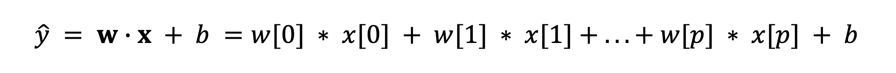

Where:

- `y^` is the predicted value.

- `b` is the bias term.

- `w` is the weight vector.

- `x` is the input feature vector.

Popular linear models used for regression include:

- **_Linear Regression_**

- **_Ridge Regression_**

- **_Lasso Regression_**

### Linear Regression

- Also known as `Ordinary Least Squares (OLS)`.

- This is the simplest linear method for regression.

- Linear regression finds the parameters `w` and `b` the mean squared error between predictions, `y^`, and the true values, `y`, for the training set.

- The `mean squared error` is the sum of the squared differences between the
  predictions and the true values, divided by the number of samples.

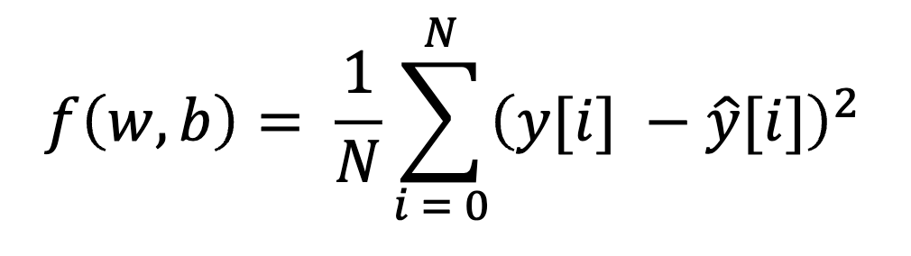

Where:

- `N` is the number of samples.

- `y^[i] = w[0] * x[i][0] + b`

- `y[i]` is the true value.

Example:

```python
from sklearn.linear_model import LinearRegression

# Instantiate the regressor
lr = LinearRegression()

# Fit the regressor to the data
lr.fit(X, y)

# Predict the labels of the test set
y_pred = lr.predict(X_test)
```

_The code snippet above shows how to use a `linear regression model` to predict the labels of the test set._

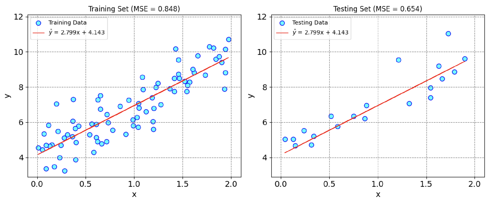

### Ridge Regression

- It is also a linear model for regression, so it uses the same formula as linear regression.

- For ridge regression, the coefficients `w` are chosen not only so that they predict well on the training data, but also to fit an additional constraint.

- The additional constraint is that the magnitude of the coefficients must be as small as possible; all entries of `w` should be close to zero, called `L2 regularization`.

- The square of the `L2 norm` of the `w` is defined as:

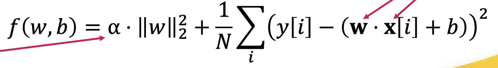

Where:

- `α` is a hyperparameter that controls the amount of regularization applied to the coefficients of a linear model. The larger the value, the more aggressive the penalization is. It can be any real value between o and infinity.

- Regularization means explicitly restricting a model to avoid over-fitting.

Example:

```python
from sklearn.linear_model import Ridge

# Instantiate the regressor
ridge = Ridge(alpha=0.1, normalize=True)

# Fit the regressor to the data
ridge.fit(X_train, y_train)

# Predict the labels of the test set
y_pred = ridge.predict(X_test)
```

_The code snippet above shows how to use a `ridge regression model` to predict the labels of the test set._

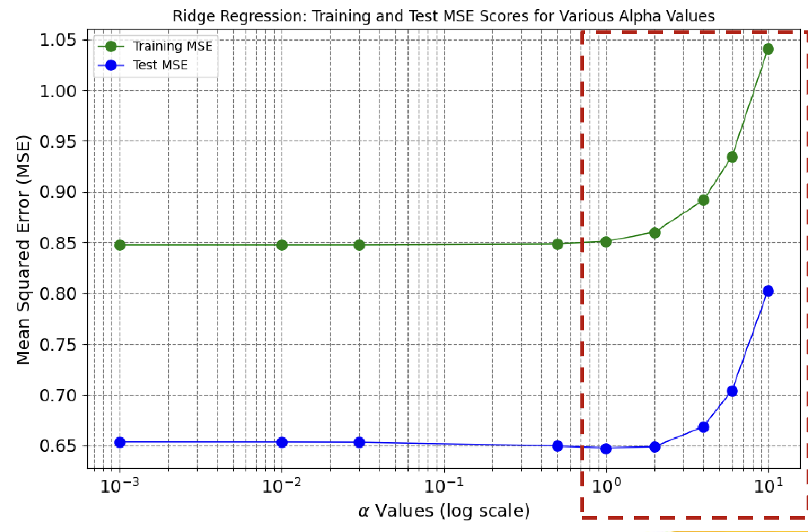

### Lasso Regression

- Alternative to ridge regression for regularizing linear regression.

- The lasso regression restricts the coefficients to be close to zero, but in a slightly different way, called `L1 regularization`.

- The `L1 norm` of the `w` is defined as:

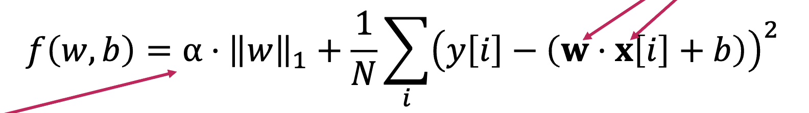

Where:

- `α` is the regularization parameter.

- The consequence of L1 regularization is that when using the lasso, some
  coefficients are exactly zero.

- This means some features are entirely ignored by the model.

- This can be seen as a form of automatic feature selection.

- Can reveal the most important features in the model.

Example:

```python
from sklearn.linear_model import Lasso

# Instantiate the regressor
lasso = Lasso(alpha=0.1, normalize=True)

# Fit the regressor to the data
lasso.fit(X_train, y_train)

# Predict the labels of the test set
y_pred = lasso.predict(X_test)
```

_The code snippet above shows how to use a `lasso regression model` to predict the labels of the test set._

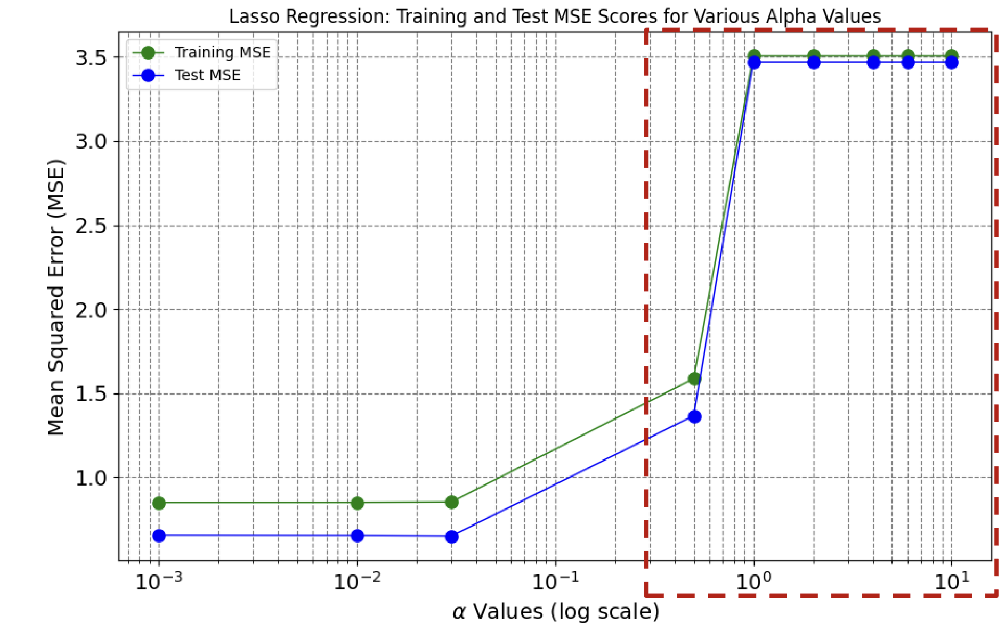

---

## Linear Regression Accuracy Metrics

- **_Mean Squared Error (MSE)_**

- **_R² score (Coefficient of Determination)_**

### Mean Squared Error (MSE)

The Mean Squared Error (MSE) is a fundamental metric used to quantify the goodness of fit of a regression model by measuring the average squared difference between the predicted values, `y^`, and the actual values, `y`, of the dependent variable.

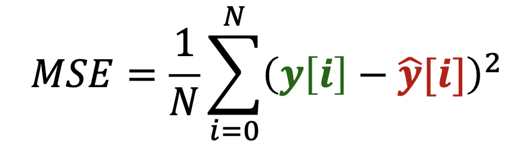

Where:

- `N` is the number of datapoints in the dataset.

- `y[i]` signifies the actual value of the dependent variable for the i-th data point.

- `y^[i]` corresponds to the predicted value of the dependent variable for the i-th data point based on the regression model.

Example:

```python
from sklearn.metrics import mean_squared_error

# Compute the mean squared error of the regressor
mse = mean_squared_error(y_test, y_pred)
```

_The code snippet above shows how to use the `mean squared error` to evaluate the performance of a regression model._

### R² Score (Coefficient of Determination)

1. R-squared is the ration of the explained variation to the total variation in the dependent variable.

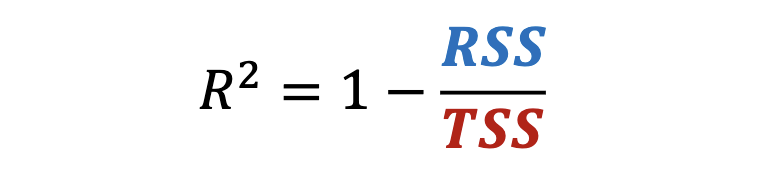

Where:

- `RSS` is the residual sum of squares.

- `TSS` is the total sum of squares.

2. R-squared can also be expressed as the square of the correlation coefficient, which measures the strength and direction of the linear relationship between two variables.

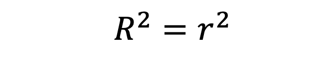

Where:

- `r` is the correlation coefficient.

3. R-squared can be negative if the model fits worse than a horizontal line, which is the simplest model that uses the mean of the dependent variable as a constant prediction.

Example:

```python
from sklearn.metrics import r2_score

# Compute the R² score of the regressor
r2 = r2_score(y_test, y_pred)
```

_The code snippet above shows how to use the `R² score` to evaluate the performance of a regression model._

---

## Linear Models For Classification

For classification, the general prediction formula for a linear model looks like this:

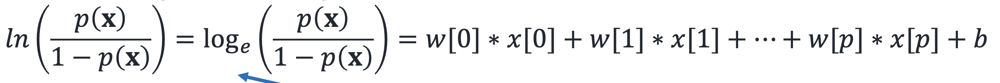

Where:

- `x` is the input feature vector.

- `w` is the weight vector.

- `b` is the bias term.

- `p(x)` is the probability that the input `x` belongs to the positive class.

Some popular linear models used for classification include:

- **_Logistic Regression_**

- **_Support Vector Machines (SVM)_**

### Logistic Regression

- Primarily used for **classification**, not regression, despite its name.

- It’s a statistical model used to predict the probability of a binary outcome, typically denoted as class 0 and class 1.

- The logistic regression model estimates the probability that a given input
  belongs to one of these two classes.

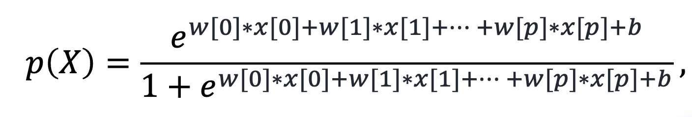

Example:

```python
from sklearn.linear_model import LogisticRegression

# Instantiate the classifier
logreg = LogisticRegression()

# Fit the classifier to the data
logreg.fit(X_train, y_train)

# Predict the labels of the test set
y_pred = logreg.predict(X_test)
```

_The code snippet above shows how to use a `logistic regression model` to predict the labels of the test set._

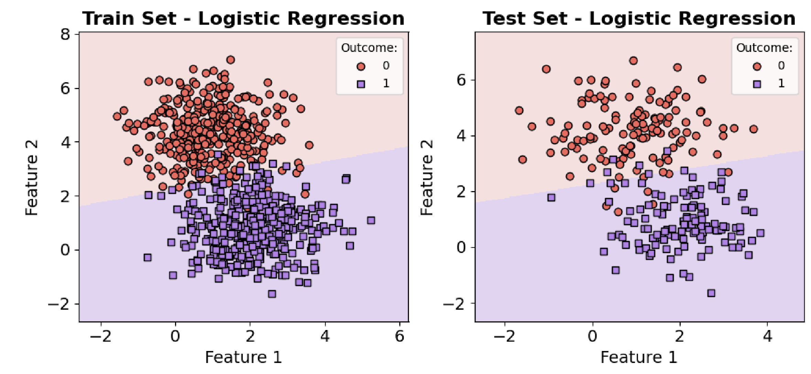

---

## Linear Classification Accuracy Metrics

- **_Confusion Matrix_**

- **_Accuracy_**

- **_Precision_**

- **_Recall_**

- **_F1 Score_**

### Confusion Matrix

A confusion matrix is a table that is often used to describe the performance of a classification model on a set of test data for which the true values are known.

- **True Positives (TP)**: The number of instances that are actually positive (P) and are correctly predicted as positive by the classification algorithm.
- **False Positives (FP)**: The number of instances that are actually negative (N) but are incorrectly predicted as positive (P) by the algorithm.
- **True Negatives (TN)**: The number of instances that are actually negative (N) and are correctly predicted as negative by the algorithm.
- **False Negatives (FN)**: The number of instances that are actually positive (P) but are incorrectly predicted as negative (N) by the algorithm.


Example:

```python
from sklearn.metrics import confusion_matrix

# Compute the confusion matrix of the classifier
cm = confusion_matrix(y_test, y_pred)
```

_The code snippet above shows how to use a `confusion matrix` to evaluate the performance of a classification model._

### Accuracy

Accuracy is a metric that quantifies the ratio of correctly classified instances to
the total predictions made by a model.


Example:

```python
from sklearn.metrics import accuracy_score

# Compute the accuracy of the classifier
accuracy = accuracy_score(y_test, y_pred)
```

_The code snippet above shows how to use the `accuracy` metric to evaluate the performance of a classification model._

### Precision

Precision is a metric that measures the accuracy of `positive predictions` generated
by a model, taking `false positives` into account.


Example:

```python
from sklearn.metrics import precision_score

# Compute the precision of the classifier
precision = precision_score(y_test, y_pred)
```

_The code snippet above shows how to use the `precision` metric to evaluate the performance of a classification model._

### Recall

Recall, also known as sensitivity or the true positive rate, quantifies a model’s
capacity to identify all positive instances, even when considering false negatives.


Example:

```python
from sklearn.metrics import recall_score

# Compute the recall of the classifier
recall = recall_score(y_test, y_pred)
```

_The code snippet above shows how to use the `recall` metric to evaluate the performance of a classification model._

### F1 Score

The F1-Score presents a harmonious equilibrium between precision and recall,
while accounting for both false positives and false negatives.


Example:

```python
from sklearn.metrics import f1_score

# Compute the F1 score of the classifier
f1 = f1_score(y_test, y_pred)
```

_The code snippet above shows how to use the `F1 score` to evaluate the performance of a classification model._

---

## Decision Trees


Decision trees are widely used models for classification and regression tasks. They learn a hierarchy of if/else questions, leading to a decision.

### Key Concepts

- The top of the decision tree is referred to as the root node.

- A leaf node is a node that has no children. A node that does have children is known as an internal node.

- Nodes in a tree are leveled by their distance from the root (level 0). The tree’s height is the maximum level of any node.

### Gini Impurity

The Gini impurity is a measure of how likely a randomly chosen element from a set would be incorreclty labeled if it was randomly labeled according to the distribution of labels in the set.


Where **_k_** is the number of classes in **_pi_** is the probability of choosing an element of class **_i_**. The Gini impurity ranges from `0` to `0.5`.

- `0` means the set is **perfectly pure** (all the elements belong to the same class).

- `0.5` means the set is **completely impure** (equal probability of choosing any class).

### Decision Tree Classification Uses Gini Impurity

- To use Gini in decision tree classification, the algorithm compares the Gini values of different possible splits and chooses the one that minimizes the Gini value.

- This means that the algorithm tries to find the best feature and the best threshold to divide the data into two subsets, such that the subsets are more pure than the original node.

- The algorithm repeats this process recursively until all the nodes are pure or some stopping criteria are met.

### Predicting New Values

- A prediction on a new data point is made by checking which region of the partition the point lies in and then assigning the majority target (or the single target in the case of pure leaves) in that region to the predicted value.

- The region can be found by traversing the tree from the root and going left or right, depending on whether the test is fulfilled or not.

```python
from sklearn.tree import DecisionTreeClassifier

dtc = DecisionTreeClassifier(max_depth=2, random_state=0)

# Fit the classifier to the data
dtc.fit(X_train, y_train)

# Predict the labels of the test set
y_pred = dtc.predict(X_test)
```

_The code snippet above shows how to use a `decision tree classifier` to predict the labels of the test set._

### Difference Between Hyperparameter and Parameter

- **Hyperparameter**: It’s a configuration setting for the model. Its value is set prior to the commencement of the learning process and is not learned from the data.

- **Parameters**: It’s an internal variable of a model. Its value is learned from the
  data during the training process.

### Decision Tree Hyperparameter

- **max_depth**: This hyperparameter controls the maximum depth of the three.

- **min_samples_split**: This hyperparameter dictates the minimum number of sample required to split an internal node. By increasing this value, the tree becomes more constrained as it has to consider more samples at each node, making it harder for the model to fit to noise in the training data.

- **min_samples_leaf**: This is the minimum number of samples required to be at a leaf node. This hyperparameter prevents the model from learning very specific patterns from the training data.

- **max_features**: The number of features to consider when looking for the best split. By reducing the number of features considered at each split, we can add randomness to the model making it more robust to noise.

Example:

```python
from sklearn.tree import DecisionTreeClassifier

dtc = DecisionTreeClassifier(max_depth=None, max_leaf_nodes=5, random_state=0)

# Fit the classifier to the data
y_pred = dtc.fit(X_train, y_train)

# Predict the labels of the test set
y_pred = dtc.predict(X_test)
```

_The code snippet above shows how to use a `decision tree classifier` to predict the labels of the test set._


### Decision Tree Regression

- Decision trees can also be used for regression.

- Splits are evaluated based on Mean Squared Error (MSE) instead of Gini impurity.

- Subsequent levels result in reduced mean squared error.

```python
from sklearn.tree import DecisionTreeRegressor
from sklearn.metrics import mean_squared_error

# Split the data into training and test sets
X_train, X_test, y_train, y_test = train_test_split(X, y, test_size=0.2, random_state=42)

# Instantiate the regressor
dtr = DecisionTreeRegressor(criterion='squared_error', splitter='best', max_leaf_nodes= 2)

# Fit the regressor to the data
_ = dtr.fit(X, y)

# Predict the labels of the test set
y_hat = dtr.predict(X[X[:, 1] <= 1.067])

# Compute the mean squared error of the regressor
mse = metrics.mean_squared_error(y_hat, y[X[:, 1] <= 1.067])
```

_The code snippet above shows how to use a `decision tree regressor` to predict the labels of the test set and compute the `mean squared error` of the regressor._

### Decision Tree Strengths

- As each feature is processed separately, no pre-processing like normalization or standardization of features is needed.

- Decision trees work well when you have features that are on
  completely different scales, or a mix of binary and continuous
  features.

- The resulting model can easily be visualized and understood by
  non-experts (at least for smaller trees).

### Decision Tree Weakness

- Even with the use of pre-pruning, decision tree models tend to over-fit and provide poor generalization performance.

---

## Random Forest

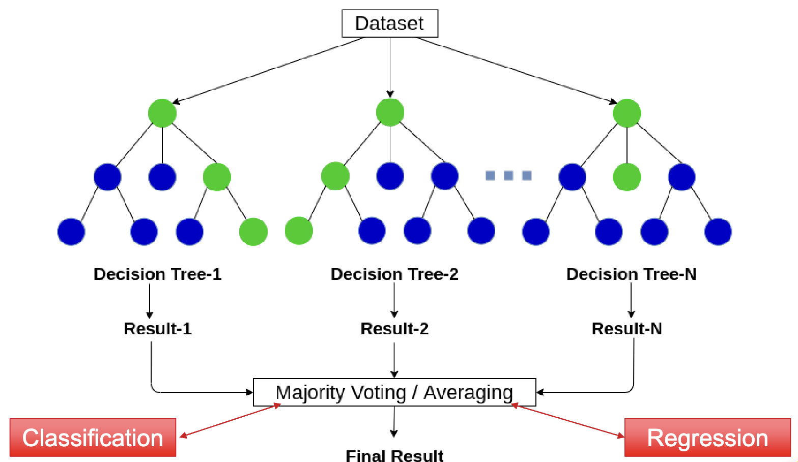

A Random Forest is essentially a collection of Decision Trees, where every tree is slightly different from the others. The idea behind random forests is that each tree might do a relatively good job of predicting, but might over-fit on part of the data.

### Steps to Create a Random Forest

1. Select the number of trees to use (hyperparameter is **_n_estimators_**).

2. Random forests get their name from injecting randomness into the tree building to ensure each tree is different. There are two ways in which the trees in a random forest are randomized:

- **Select Random Data Points**:

  - For each tree, a **bootstrap sample** is created.

  - A bootstrap sample is the same size as the original data, but contains a random assortment of the data, where some of the data samples are missing (approx. 1/3) and some data samples are repeated.

  - A decision tree is then made using the bootstrap sample.

```python
from sklearn.utils import resample

# Create a bootstrap sample
bootstrap_sample = resample(X_train, y_train, replace=True, random_state=0)
```

_The code snippet above shows how to create a `bootstrap sample` using the `resample` function._

- **Select Random Features**:

  - the algorithm randomly selects a **subset of the features**, and it looks for the best possible test involving one of these features.

  - The number of features that are selected is controlled by the **_max_features_** parameter.

  - This selection of a subset of features is repeated separately in each node, so that each node in the tree splits the dataset using a different subset of the features.

  - A **high _max_features_** value means that the trees in the random forest will be very similar, but they will be able to fit the data easily, using the most distinctive features.

  - A **low _max_features_** value means that the trees in the random forest will be quite different, but that each tree might need to be very deep to fit the data well.

### Random Forest Regressor

For regression, we can average the results to get our final prediction.

```python
from sklearn.ensemble import RandomForestRegressor

# Instantiate the regressor
rfr = RandomForestRegressor(n_estimators=4, random_state=0, max_leaf_nodes=3)

# Fit the regressor to the data
rfr.fit(X_train, y_train)

# Predict the labels of the test set
y_pred = rfr.predict(X_test)
```

_The code snippet above shows how to use a `random forest regressor` to predict the labels of the test set._

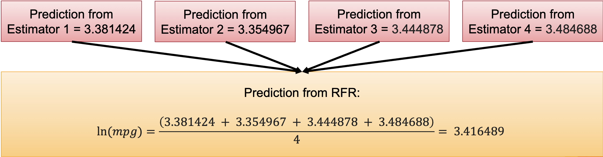

### Random Forest Classifier

For classification, each algorithm makes a "soft" prediction, providing a probability of each possible output label. The probabilities predicted by all the trees are averaged, and the class with the highest probability is the final prediction.

```python
from sklearn.ensemble import RandomForestClassifier

# Instantiate the classifier
rfc = RandomForestClassifier(n_estimators=4, random_state=0, max_leaf_nodes=3)

# Fit the classifier to the data
rfc.fit(X_train, y_train)

# Predict the labels of the test set
y_pred = rfc.predict(X_test)
```

_The code snippet above shows how to use a `random forest classifier` to predict the labels of the test set._

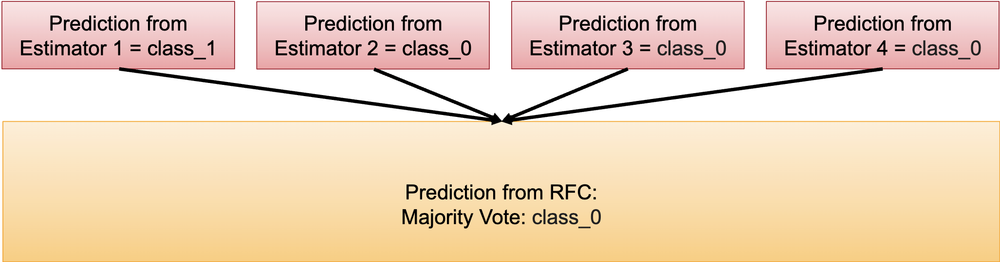

### Parameters

- **_random_state_**: Setting this variable is important for reproducibility.

- **_max_features_**: Determines how random each tree is

- **_n_estimators_**: Larger is always better. Averaging more trees will yield a more robust ensemble by reducing over-fitting.

### Strengths

- Random forests share all the benefits of decision trees.

- They are very powerful, often work well without heavy tuning of the parameters, and don’t require scaling of the data.

- Random forests for regression and classification are currently among the most widely used machine learning methods.

### Weaknesses

- Random forests require more memory and are slower to train and predict than linear models.

- Random forests don’t tend to perform well on very high dimensional, sparse data, such as text data.

---

## Gradient Boosted Trees

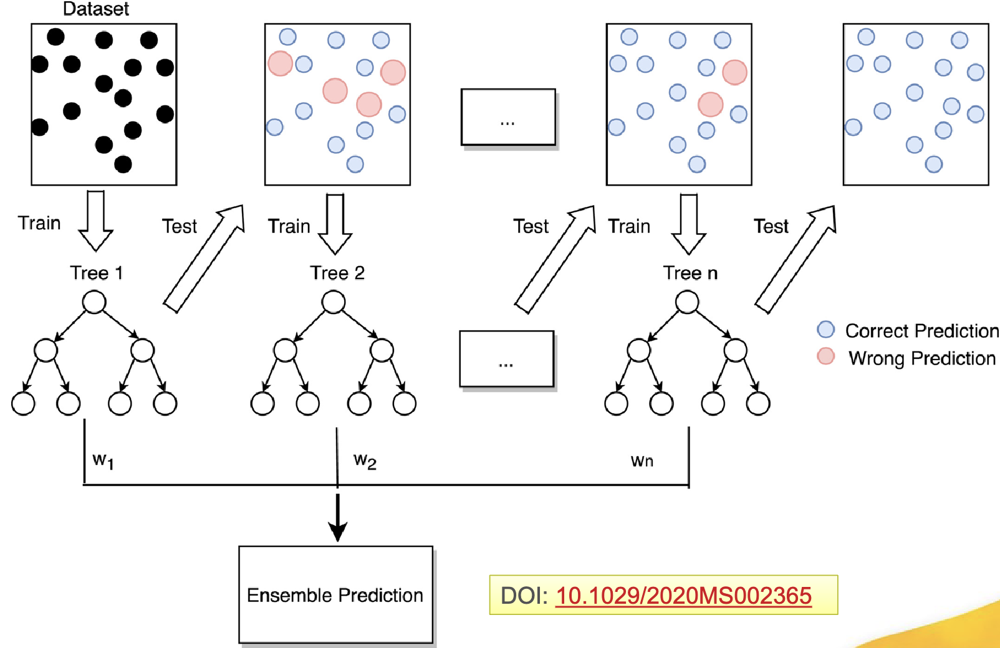

Gradient boosting works by iteratively training the weak learners on gradient-based functions and incorporating them into the model as **_boosted_** participants.

- At its core, gradient boosting works by combining multiple gradient steps to build up a strong predicting model from weak estimators residing in a gradient function space with additional weak learners joining the gradient function space after each iteration of gradient boosting.

### Control Parameters

- **_n_estimators_**: The number of trees created.

- **_learning_rate_**: Controls how strongly each tree tries to correct after the previous one.

### Gradient Boosting Regressor

```python
from sklearn.ensemble import GradientBoostingRegressor

# Instantiate the regressor
gbr = GradientBoostingRegressor(n_estimators=100, random_state=0, learning_rate=0.1)

# Fit the regressor to the data
gbr.fit(X_train, y_train)

# Predict the labels of the test set
y_pred = gbr.predict(X_test)
```

_The code snippet above shows how to use a `gradient boosting regressor` to predict the labels of the test set._

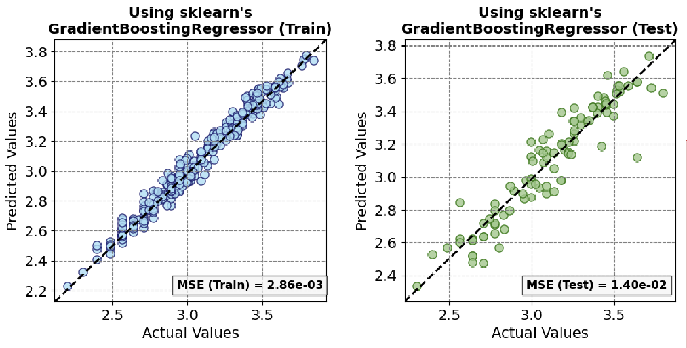

### Gradient Boosting Classifier

```python
from sklearn.ensemble import GradientBoostingClassifier

# Instantiate the classifier
gbc = GradientBoostingClassifier(n_estimators=100, random_state=0, learning_rate=0.1)

# Fit the classifier to the data
gbc.fit(X_train, y_train)

# Predict the labels of the test set
y_pred = gbc.predict(X_test)
```

_The code snippet above shows how to use a `gradient boosting classifier` to predict the labels of the test set._

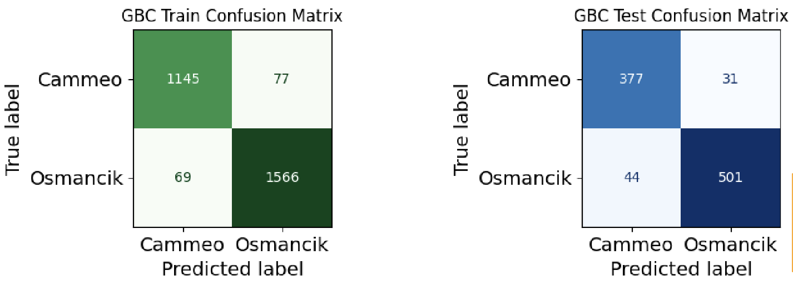

### Strengths

- Gradient boosted decision trees are among the most powerful and widely used models for supervised learning.

### Weaknesses

- Their main drawback is that they require careful tuning of the parameters and may take a long time to train.

- As with other tree-based models, it often does not work well on high-dimensional sparse data.

### Random Forest vs Gradient Boosting

- As both gradient boosting and random forests perform well on similar kinds of data, a common approach is to first try random forests.

- If random forests work well but prediction time is at a premium, or it’s important to squeeze out that last percentage of accuracy from the machine learning model, moving to gradient boosting often helps.

---

## Support Vector Machines (SVM)

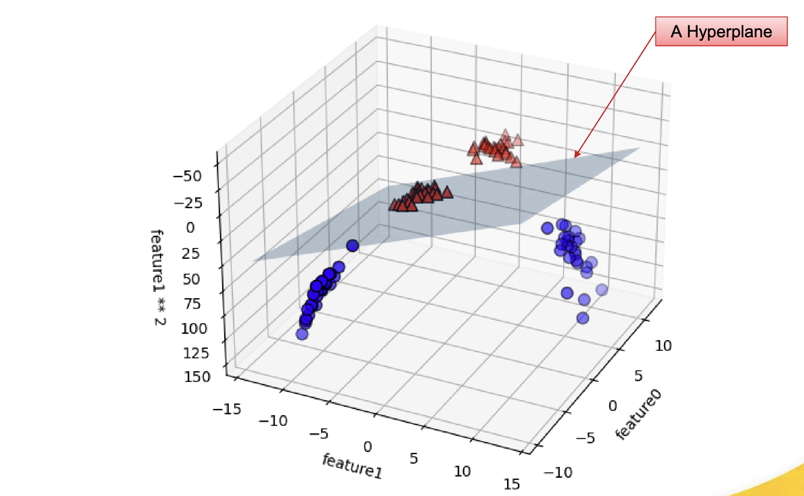

In Support Vector Machines (SVM), support vectors are the data points that lie closest to the decision boundary (or hyperplane). They are the data points most difficult to classify and have direct influence on the optimal location of the decision boundary.

### Hyperplane

A hyperplane is a plane with one less dimension than the dimension of its ambient space. For example, if space is 3-dimensional, then its hyperplanes are 2-dimensional planes. Moreover, if the space is 2-dimensional, its hyperplanes are the 1-dimensional lines.

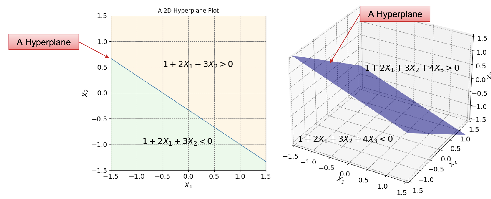

```python
from sklearn.svm import SVC
import numpy as np

# Instantiate the classifier
svc = SVC(kernel='linear')

# Fit the classifier to the data
svc.fit(X_train, y_train)

# Get the support vectors
support_vectors = svc.support_vectors_

# Get the coefficients and the intercept
coefficients = svc.coef_
intercept = svc.intercept_

# Get the margin
margin = 2 / np.linalg.norm(coefficients)
```

---
