# Machine Learning

---

## Table of Contents

- [Numpy](#numpy)
  - [What Is Numpy Array?](#what-is-numpy-array)
  - [List To Numpy](#list-to-numpy)
  - [NumPy Indexing and Slicing](#numpy-indexing-and-slicing)
  - [Filtering](#filtering)
- [Pandas](#pandas)
  - [Data Types](#data-types)
  - [‘loc’ - Label-Based Indexing](#loc---label-based-indexing)
  - [Identifying Missing Data](#identifying-missing-data)
  - [Filling Missing Data](#filling-missing-data)
  - [GroupBy](#groupby)
- [Matplotlib](#matplotlib)
  - [Line Plot](#line-plot)
  - [Scatter Plot](#scatter-plot)
  - [Bar Plot](#bar-plot)
- [Data Processing](#data-processing)
  - [Missing Values](#missing-values)
  - [Errors and Noise](#errors-and-noise)
- [Model Validation](#model-validation)
  - [Training and Test Sets](#training-and-test-sets)
  - [Cross-Validation](#cross-validation)
- [Model Selection](#model-selection)
  - [Bias and Variance](#bias-and-variance)
- [Supervised Learning](#supervised-learning)
- [Linear Models](#linear-models)
- [Validation Models](#validation-models)
  - [Confusion Matrix](#confusion-matrix)
  - [Accuracy](#accuracy)
  - [Precision](#precision)
  - [Recall](#recall)
  - [F1 Score](#f1-score)
- [Decision Trees](#decision-trees)
  - [Key Concepts](#key-concepts)
  - [Gini Impurity](#gini-impurity)
  - [Decision Tree Classification Uses Gini Impurity](#decision-tree-classification-uses-gini-impurity)
  - [Predicting New Values](#predicting-new-values)
  - [Difference Between Hyperparameter and Parameter](#difference-between-hyperparameter-and-parameter)
  - [Decision Tree Hyperparameter](#decision-tree-hyperparameter)

---

## Numpy

Python includes a module named numpy that can be used to store data in a matrix-like object.

Import statement:

```python
import numpy as np
```

### What Is Numpy Array?

- A multi-dimensional array (data type = ndarray) can be created from a multi-dimensional list using the NumPy module.
- A one-dimensional array is an array that has only one dimension and contains elements of the same type and size.

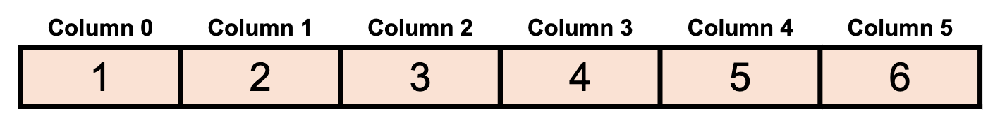

- A two-dimensional array is an array that has two dimensions and contains elements of the same type and size.

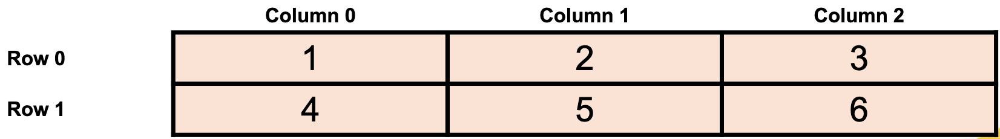

- An array has “axis/axes” to indicate its dimensions.
- The first axis (axis = 0) of a 2-D array shows the number of rows and the second axis (axis = 1) shows the number of columns.
- Indexing or slicing the array can be used to get or change its elements, similar to lists.

### List To Numpy

```python
list1 = [1, 2, 3, 4, 5]
arr1 = npm.array(list1)
```

This also works for multi-dimensional lists, but only if the list elements have the same type (a list with both integers and floats will be converted to all floats)

### NumPy Indexing and Slicing

- You can index NumPy arrays similar to lists
- You can also slice NumPy arrays like lists

For a 2-D array:

```python
sub_arr = arr[start_row:end_row, start_col:end_col]
```

To access a whole row or column you can use empty slicing:

- `arr[:,0]` for all the rows in the first column
- `arr[0,:]` for all the columns in the first row

Example:

```python
arr = np.array([1,2,3,4,5,6])

print(arr[3]) #Output: 4

test1 = arr[3:]
test1[0] = 99

print(arr) # Output: [99, 5, 6]
```

### Filtering

To select array elements that meet a certain criterion, you can apply a `conditional expression`.

Example:

```python
# Creating a NumPy array with elements -2, -1, 0, 1, and 2
arr = np.array([-2, -1, 0, 1, 2])

# Selecting and displaying only the elements in the array that are greater than 0
selected_elements = arr[arr > 0] # Output: array([1, 2])
```

We could also use `np.where()`.

Example:

```python
# Creating a NumPy array with elements -2, -1, 0, 1, and 2
arr = np.array([-2, -1, 0, 1, 2])

# Using np.where to find the indices where the elements are greater than 0
indices = np.where(arr > 0)

# Selecting and displaying the elements that satisfy the condition using the obtained indices
selected_elements = arr[indices]
```

---

## Pandas

Pandas is a Python module used to import, export, and manipulate data.

import statement:

```python
import pandas as pd
```

### Data Types

When data is imported using pandas, there are two different data types depending on the dimensions:

- 1-D data is stored in a Series
- 2-D data is stored in a DataFrame
- Each column in a DataFrame represents a Series
- The values in each Series (data frame columns) must be the same type.

### ‘loc’ - Label-Based Indexing

The `loc` method in Pandas lets you access DataFrame data by labels or boolean array-based indexing.
Likewise, the `iloc` method lets you access DataFrame data by integer positions, like indexing elements in a Python list.

Example:

```python
# Selecting two rows and all columns that have the index values 'ID1' and 'ID3'
df.loc[['ID1', 'ID3'], :]

# Selecting multiple rows and columns where age is greater than 30 and then selecting the 'Name' and 'Age' columns
df.loc[df['Age'] > 30, ['Name', 'Age']]
```

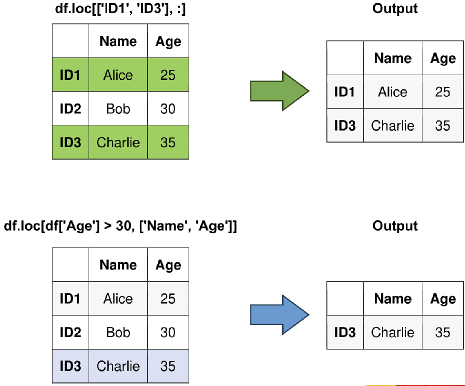

### Identifying Missing Data

The `isna()` and `isnull()` methods are used interchangeably to check for missing values within a DataFrame or Series.

```python
df.isna()

# or

df.isnull()
```

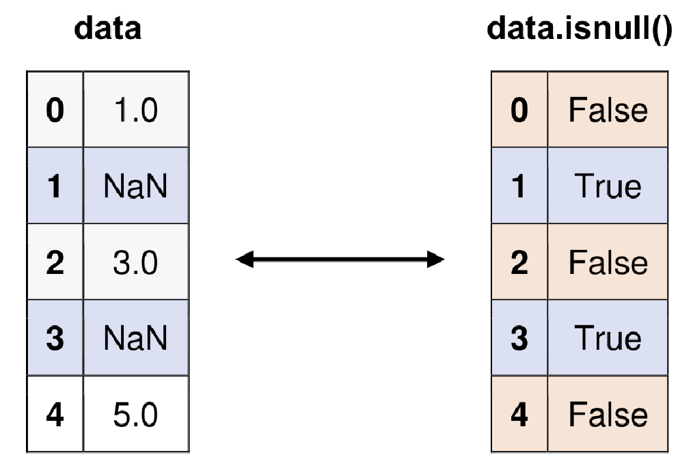

### Filling Missing Data

The `fillna()` function is a versatile tool for replacing missing or NaN (Not a Number) values within a DataFrame or Series. Available methods are `ffill` for forward filling (propagating the last valid value forward) and `bfill` for backward filling (propagating the next valid value backward).

```python
# Backward fill

df.bfill()

# Forward fill

df.ffill()
```

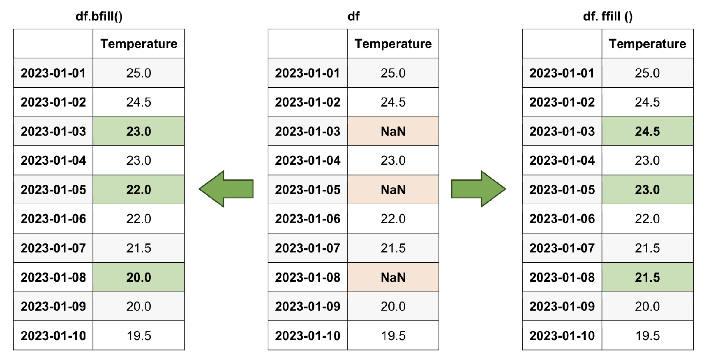

### GroupBy

Pandas groupby is a method that splits the dataframe into groups based on one or more columns, applies a function to each group, and combines the results into a new DataFrame.

Example:

```python
Grouped = df.groupby('Category')

Result = Grouped.agg({'Value': ['mean', 'sum', 'count', 'max', 'min']})
```

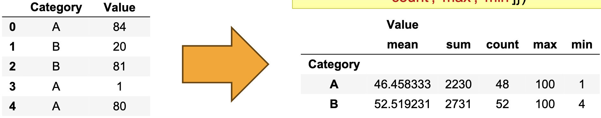

---

## Matplotlib

Matplotlib is a built-in module in Python used for plotting.

Import statement:

```python
import matplotlib.pyplot

# or

import matplotlib.pyplot as plt
```

### Line Plot

Plots a line graph. It is commonly used for visualizing `continuous data`, like time
series or continuous functions.

```python
matplotlib.pyplot.plot()

# or

plt.plot()
```

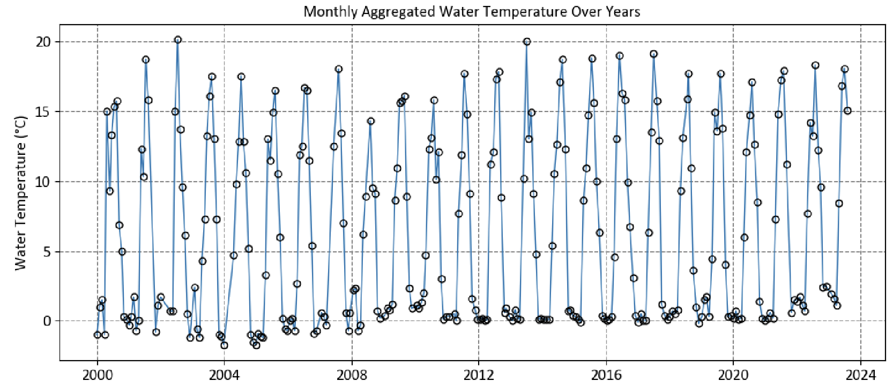

### Scatter Plot

Scatter plots are used to visualize the relationship between two numerical variables, allowing you to `identify patterns, trends, clusters, correlations, and outliers`.

```python
matplotlib.pyplot.scatter()

# or

plt.scatter()
```

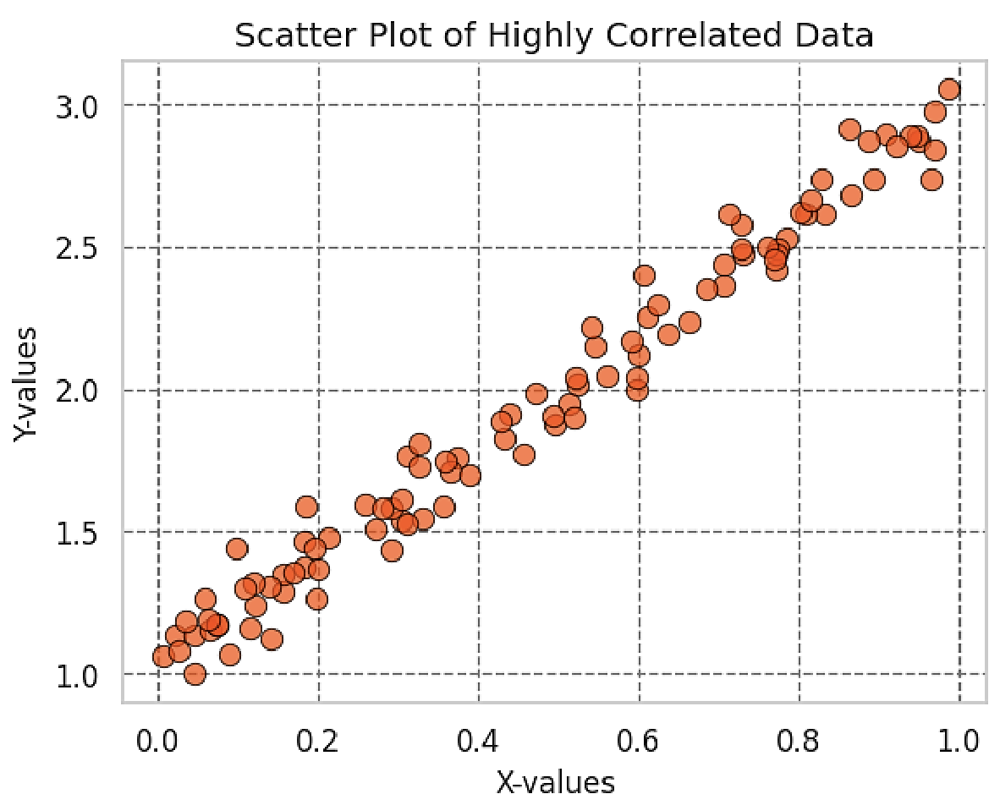

### Bar Plot

Bar plots are used to compare the values of different categories, display frequencies or counts of categorical variables, and visualize the relationship between categorical and numerical variables. `Useful for comparing discrete data`.

```python
matplotlib.pyplot.bar()

# or

plt.bar()
```

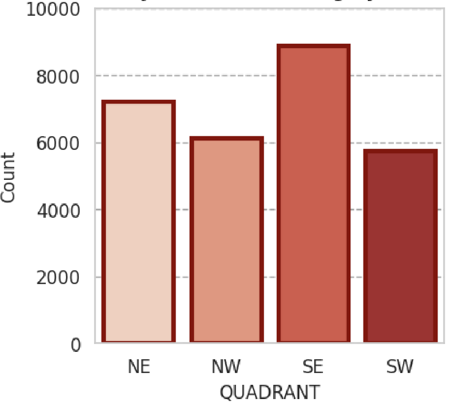

---

## Data Processing

If your dataset is based on real-life data, it might not be perfect.

Your dataset might include:

- Missing values
- Erroneous measurements
- Noise

### Missing Values

#### How to Find Missing Values in a Pandas DataFrame

- Check the data type for each column using `df.dtypes`. If a column has invalid data points, such as empty strings or non-numeric values, the data type will be object.
- You can either manually change the data type for all the columns using `df.astype()` or replace the invalid points with NaN using `df.replace()`.
- Once all the columns are the proper data type, you can count the number of NaN values using one of these methods:

Other usefull functions are:

```python
df.isnull().sum()

# or

df.isna().sum()

# or

df.info()
```

#### What to Do with Missing Values?

Pandas offers several built-in functions to deal with missing values in different ways.

- You can choose to remove the rows or columns that contain NaN values.
- Yu can replace them with a specific value or a calculated value based on the rest of the data.

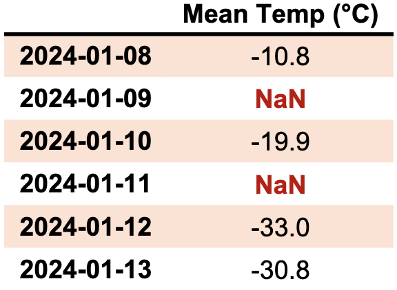

#### Dropping NaN Values

Dropping values is easy with a Series, as you can drop the values individually. For DataFrame, it is a bit more complicated as you can not have an uneven number of rows.

- You can drop any row or drop any column that has at least one NaN value (based on the specified axis).
- You can use the `how` or `thresh` keywords to specify the number of NaN values that must exist before you drop the row or column.

#### Filling NaN Values

- **Forward-fill**: Use the previous valid value to fill the missing value, which
  can be useful for time series data.

```python
df.ffill()
```

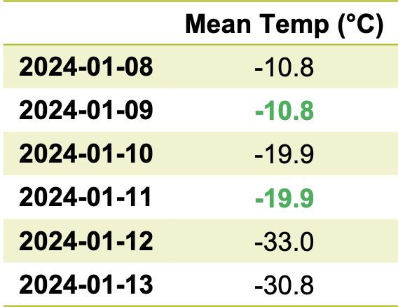

- **Back-fill\*\***: Use the next valid value to fill the missing value, which can be
  useful for reverse time series data.

```python
df.bfill()
```

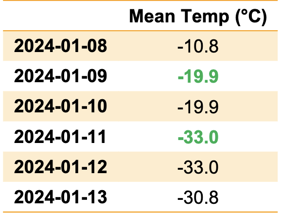

- **Custom code**: Write your own logic to fill the missing values, which can
  be useful for complex or specific cases.

```python
df.interpolate(method='linear')
```

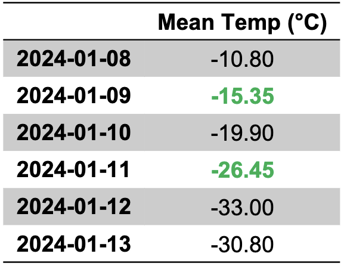

### Errors and Noise

#### Detecting Errors in Real Measurements

- To identify potential outliers, you can use different methods depending on the data's characteristics and shape, such as visualizing or analyzing them statistically.
- After finding the errors, you can handle them in the same way as you handled the NaN values. A simple way to code this is to change all the incorrect values to `np.nan` and then use your preferred method to replace the missing values.

---

## Model Validation

### Training and Test Sets

- **Training Set**: The training set is the largest part of the dataset and the foundation for model building. Machine learning algorithms use this segment to learn from the data’s patterns.

- **Test Set**: Different from the training set, the test set serves as an unbiased measure for evaluating the model’s performance on completely new and unseen data.

Example:

```python
from sklearn.model_selection import train_test_split

X_train, X_test, y_train, y_test = train_test_split(X, y, test_size=0.2, random_state=42)
```

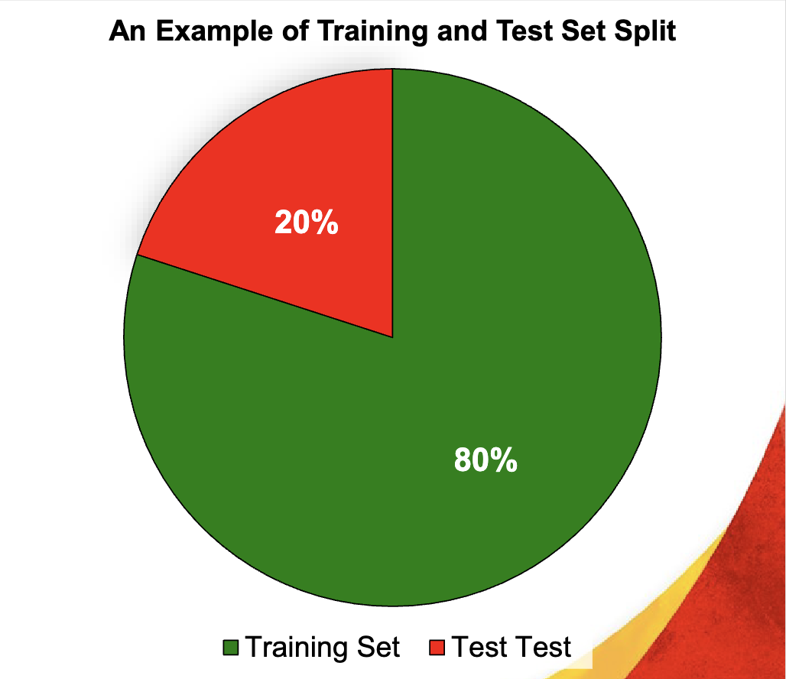

### Cross-Validation

Cross-validation is a technique to evaluate the performance of a machine learning model on `unseen data`.

Example:

If 𝒌 = 𝟑, then the data set `{𝑥1, 𝑥2, 𝑥3, 𝑥4, 𝑥5, 𝑥6}` is divided into
three subsets:

- `{𝑥1, 𝑥2}`
- `{𝑥3, 𝑥4}`
- `{𝑥5, 𝑥6}`

```python
from sklearn.cross_validation import cross_val_score

cross_val_score(model, X, y, cv=3)
```

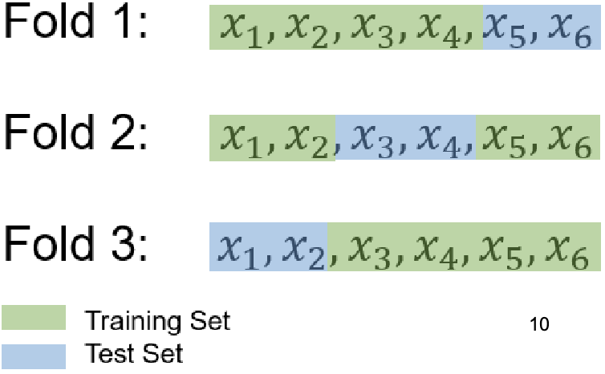

Compute the mean (average) test error across the three folds.

---

## Model Selection

### Bias and Variance

- **Bias**: The difference between the model's predicted value and the actual value. `High bias` model tend to `underfit` the data, meaning they cannot capture the complexity or patterns in the data.

- **Variance**: The sensitivity of the model to changes in the training data. `High variance` models tend to `overfit` the data, meaning they cannot generalize well to new or unseen data.

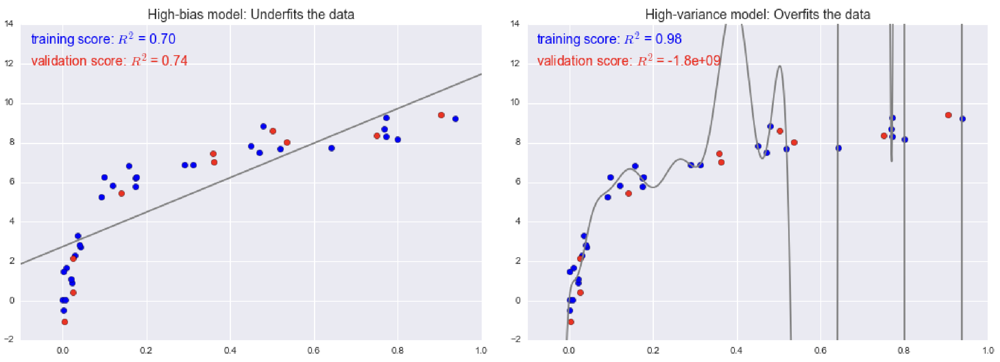

---

## Supervised Learning

Coming soon...

---

## Linear Models

Coming soon...

---

## Validation Models

### Confusion Matrix

A confusion matrix is a table that is often used to describe the performance of a classification model on a set of test data for which the true values are known.

- **True Positives (TP)**: The number of instances that are actually positive (P) and are correctly predicted as positive by the classification algorithm.
- **False Positives (FP)**: The number of instances that are actually negative (N) but are incorrectly predicted as positive (P) by the algorithm.
- **True Negatives (TN)**: The number of instances that are actually negative (N) and are correctly predicted as negative by the algorithm.
- **False Negatives (FN)**: The number of instances that are actually positive (P) but are incorrectly predicted as negative (N) by the algorithm.

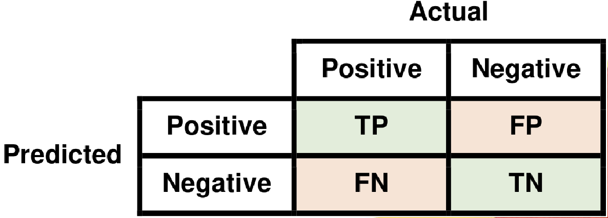

### Accuracy

Accuracy is a metric that quantifies the ratio of correctly classified instances to
the total predictions made by a model.

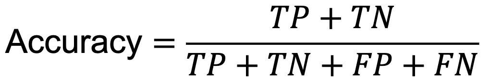

### Precision

Precision is a metric that measures the accuracy of `positive predictions` generated
by a model, taking `false positives` into account.

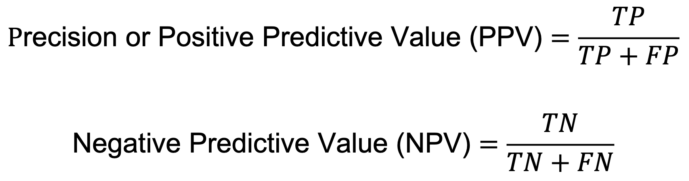

### Recall

Recall, also known as sensitivity or the true positive rate, quantifies a model’s
capacity to identify all positive instances, even when considering false negatives.

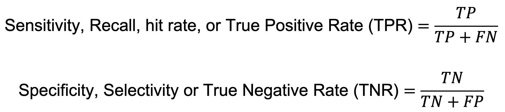

### F1 Score

The F1-Score presents a harmonious equilibrium between precision and recall,
while accounting for both false positives and false negatives.

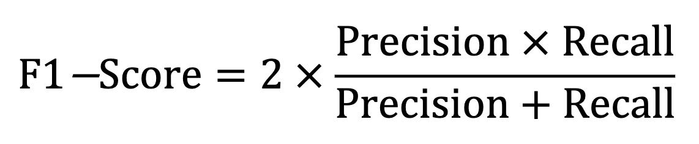

---

## Decision Trees

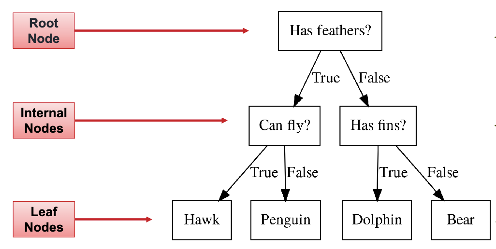

Decision trees are widely used models for classification and regression tasks. They learn a hierarchy of if/else questions, leading to a decision.

### Key Concepts

- The top of the decision tree is referred to as the root node.

- A leaf node is a node that has no children. A node that does have children is known as an internal node.

- Nodes in a tree are leveled by their distance from the root (level 0). The tree’s height is the maximum level of any node.

### Gini Impurity

The Gini impurity is a measure of how likely a randomly chosen element from a set would be incorreclty labeled if it was randomly labeled according to the distribution of labels in the set.

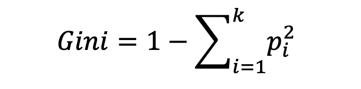

Where **_k_** is the number of classes in **_pi_** is the probability of choosing an element of class **_i_**. The Gini impurity ranges from `0` to `0.5`.

- `0` means the set is **perfectly pure** (all the elements belong to the same class).

- `0.5` means the set is **completely impure** (equal probability of choosing any class).

### Decision Tree Classification Uses Gini Impurity

- To use Gini in decision tree classification, the algorithm compares the Gini values of different possible splits and chooses the one that minimizes the Gini value.

- This means that the algorithm tries to find the best feature and the best threshold to divide the data into two subsets, such that the subsets are more pure than the original node.

- The algorithm repeats this process recursively until all the nodes are pure or some stopping criteria are met.

### Predicting New Values

- A prediction on a new data point is made by checking which region of the partition the point lies in and then assigning the majority target (or the single target in the case of pure leaves) in that region to the predicted value.

- The region can be found by traversing the tree from the root and going left or right, depending on whether the test is fulfilled or not.

```python
from sklearn.tree import DecisionTreeClassifier

dtc = DecisionTreeClassifier(max_depth=2, random_state=0)

# Fit the classifier to the data
dtc.fit(X_train, y_train)

# Predict the labels of the test set
y_pred = dtc.predict(X_test)
```

### Difference Between Hyperparameter and Parameter

- **Hyperparameter**: It’s a configuration setting for the model. Its value is set prior to the commencement of the learning process and is not learned from the data.

- **Parameters**: It’s an internal variable of a model. Its value is learned from the
  data during the training process.

### Decision Tree Hyperparameter

- **max_depth**: This hyperparameter controls the maximum depth of the three.

- **min_samples_split**: This hyperparameter dictates the minimum number of sample required to split an internal node. By increasing this value, the tree becomes more constrained as it has to consider more samples at each node, making it harder for the model to fit to noise in the training data.

- **min_samples_leaf**: This is the minimum number of samples required to be at a leaf node. This hyperparameter prevents the model from learning very specific patterns from the training data.

- **max_features**: The number of features to consider when looking for the best split. By reducing the number of features considered at each split, we can add randomness to the model making it more robust to noise.

Example:

```python
from sklearn.tree import DecisionTreeClassifier

dtc = DecisionTreeClassifier(max_depth=None, max_leaf_nodes=5, random_state=0)

# Fit the classifier to the data
dtc.fit(X_train, y_train)

```

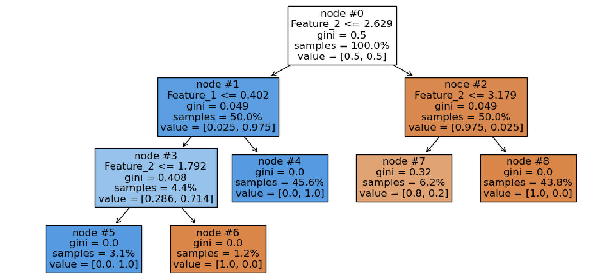

---
