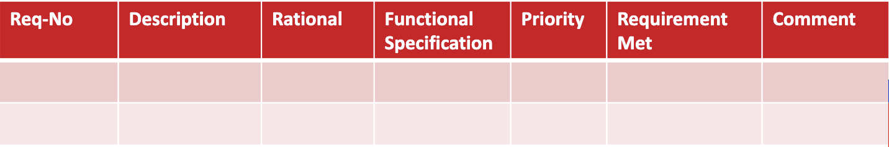

# Software Architecture

---

## Table of Contents

- [Abstraction](#abstraction)
  - [Decomposition](#decomposition)
  - [Coupling](#coupling)
  - [Cohesion](#cohesion)
  - [Agile-Driven](#agile-driven)
- [Styles](#styles)
  - [Layered](#layered)
  - [MVC (Model, View, Controller)](#mvc-model-view-controller)
  - [Pipeline](#pipeline)
  - [Microkernel](#microkernel)
  - [Service-Based](#service-based)
  - [Event-Driven](#event-driven)
  - [Other Architectures](#other-architectures)
- [Data Management](#data-management)
  - [PDCA For Data Governance](#pdca-for-data-governance)
  - [Dimensions of Data Quality](#dimensions-of-data-quality)
- [Data Modeling](#data-modeling)
  - [Database Models](#database-models)
  - [Normalizing A Relational Database](#normalizing-a-relational-database)
  - [Components Of A DBMS](#components-of-a-dbms)
- [Software Development Life Cycle](#software-development-life-cycle)
  - [Delivery Cycles](#delivery-cycles)
  - [Planning](#planning)
  - [Requirements Gathering & Analysis](#requirements-gathering--analysis)
  - [Design](#design)
  - [Implementation](#implementation)
- [Software Development Patterns](#software-development-patterns)
  - [Model-View-Controller (MVC)](#model-view-controller-mvc)
  - [SOLID Principles](#solid-principles)
- [Cloud Computing](#cloud-computing)
  - [Essential Characteristics](#essential-characteristics)
  - [Resource](#resource)
  - [Scaling](#scaling)
  - [Service Models](#service-models)
  - [Deployment Models](#deployment-models)

---

## Abstraction

High-level representation or simplification of complex systems, design or structures.

### Decomposition

Segregation is the idea of breaking down large entities into into smaller and more specialized ones. Create more modular, maintainable, and flexible software designs.

#### Poor Decomposition

- Customer class is responsible for all entities.
- Customer class is responsible for all operations.

#### Improved Decomposition

- Customer class is responsible for representing customer to access information.
- CustomerManager class is responsible for dealing with customer-related operations.

### Coupling

Coupling is the density of dependencies among classes. If a class changes and there is high coupling, many other classes will need to change as well.

#### Tight Coupling

- Customer class creates an Order object directly within its method.
- Order class maintains a direct reference to the Customer object (customer attribute).

#### Loose Coupling

- Order class no longer directly references the Customer class.
- Customer information (name and email) referred as parameters with methods get() and set().

### Cohesion

Cohesion is the degree of unity or closeness among the elements within a class. Each component should represent a single concept. All logic/data of the component should be directly applicable to the concept.

#### Low Cohesion

- Customer mixing responsibilities with createOrder and sendEmail.
- Order mixing responsabilities with calculateTotal and sendConfirmationEmail.

#### High Cohesion

- Order class no longer directly references the Customer class.
- Customer information (name and email) referred as parameters with methods get() and set().

### Agile-Driven

Architectural approach aligns with the principles and values of agile methodologies. Agile approach emphasizes flexibility, collaboration and responsiveness to change.

---

## Styles

Recurring patterns used in organizing the structure and components of a software system. Choosing the right architecture style is a critical decision that influences various aspects of software development.

### Layered

Each layer provides a specific functionalities and services to the layers above it.

Key characteristics:

- Simplicity
- Modularity
- Maintainability
- Separation of Concerns.

### MVC (Model, View, Controller)

Separate the concerns of data management, user interface and application logic.

Key characteristics:

- Separation of concerns
- User interaction
- Loose coupling
- Layered-Oriented

#### Model

Encapsulates the data and provides methods to manipulate and access data.

#### View

Represents the user interface elements and visual components.

#### Controller

Handles user input, processes requests, and updates the Model accordingly.

### Pipeline

Structures the processing of data or tasks as a series of connected processing stages.

Key characteristics:

- Sequential
- Modularity
- Parallelism
- Isolation

### Microkernel

Structure by separating the core functionality (microkernel) from additional services and functionalities.

Key characteristics:

- Flexibility
- Modularity
- Reduced complexity
- Portability

### Service-Based

Structures an application as a collection independently deployable services.

Key characteristics:

- Loose coupling
- Interoperability
- Independently deployable
- Reusability

### Event-Driven

The system flow is determined by events, such as user actions, messages from other systems.

Key characteristics:

- Events
- Responsiveness
- Communication
- Scalability

### Other Architectures

- Space-Based
- Orchestration-Driven Service-Oriented
- Microservices

---

## Data Management

- Data Stewardship

- Data Quality

- Data Integration

- Enterprise Perspectives

- Culture Change Leadership

### PDCA For Data Governance

- **Plan**: Establish a plan to solve data issue problems and determine cost and effort.

- **Do**: Implement data quality controls and processes.

- **Check**: Continuous monitoring and measurement of data quality.

- **Act**: Identify data quality issues and take corrective actions.

### Dimensions of Data Quality

- **Accuracy**: Data is correct and reliable.

- **Completeness**: Data is not missing any information.

- **Consistency**: Data is consistent across the organization.

- **Currency**: Data is up-to-date and relevant.

- **Precision**: Data is precise and accurate.

- **Privacy**: Data is secure and private.

- **Reasonableness**: Data is reasonable and logical.

- **Timeliness**: Data is available when needed.

- **Uniqueness**: Data is unique and not duplicated.

- **Validity**: Data is valid and conforms to business rules.

---

## Data Modeling

- **Database**: A collection of related data that can be stored in a central location or in multiple locations.

- **Data Hierarchy**: The structure and organization of data, which involves fields, records, and tables.

- **Database Management System (DBMS)**: Software for creating, storing, maintaining, and accessing database files.

### Database Models

- **Conceptual Model**: High-level view of the entities and their attributes.

- **Logical Model**: Detailed view of the entities and the relationships between them.

- **Physical Model**: Detailed view of the entities, their attributes, and the relationships between them.

### Normalizing A Relational Database

- Eliminate duplicated fields from the same table.

- Create separate tables for each group of related data.

- Identify each record with a unique field (primary key).

### Components Of A DBMS

- **Database Engine**: Translates logical requests to physical ones

- **Data Definition**: Create / maintain data dictionary

- **Data Manipulation**: SQL or QBE

- **Application Generation**: Design applications or parts of them

- **Data Administration**: Security (CRUD), recovery, backup

---

## Software Development Life Cycle

Software development life cycle (SDLC) is a series of well-defined phases performed in sequence that serves as a framework for developing a system or project.

### Delivery Cycles

- Predictive

- Iterative

- Incremental

- Agile

### Planning

1. Economic feasibility

2. Technical feasibility

3. Operational feasibility

4. Schedule feasibility

5. Legal feasibility

### Requirements Gathering & Analysis

Requirements are documented and tracked in a requirements traceability matrix (RTM).

### Design

- **Conceptual**: The output of analysis.

- **Logical**: Adds a hardware / software / OS layer.

- **Physical**: Specific platform design.

### Implementation

- **Coding**: Writing the code.

- **Testing**: Testing the code.

- **Deployment**: Deploying the code.

---

## Software Development Patterns

Patterns are reusable solutions to common problems in software design. From a solution design perspective different patterns exist to solve different problems.

- Creational Patterns

- Structural Patterns

- Behavioral Patterns

### Model-View-Controller (MVC)

- Model

The model manages the behavior and data of the application domain, responds to requests for information about its state (usually from the view), and responds to instructions to change state (usually from the controller).

- View

The view manages the display of information.

- Controller

The controller interprets the mouse and keyboard inputs from the user, informing the model and/or the view of change as appropriate.

### SOLID Principles

- **S - Single Responsibility Principle**: A class should have only one reason to change.

- **O - Open/Closed Principle**: A class should be open for extension, but closed for modification.

- **L - Liskov Substitution Principle**: Objects in a program should be replaceable with instances of their subtypes without altering the correctness of that program.

- **I - Interface Segregation Principle**: Software modules (classes and methods) should not be forced to depend upon interfaces that they do not use.

- **D - Dependency Inversion Principle**: High-level modules should not depend on low-level modules. Both should depend on abstractions.

---

## Cloud Computing

Cloud computing is a model for enabling ubiquitous, convenient, on-demand network access to a shared pool of configurable computing resources (e.g., networks, servers, storage,
applications, and services) that can be rapidly provisioned and released with minimal management effort or service provider interaction. This cloud model is composed of five essential characteristics, three service models, and four deployment models.

### Essential Characteristics

- On-demand

- Ubiquitous access

- Multitenancy (and resource pooling)

- Elasticity

- Measured usage

### Resource

An IT resource is a physical or virtual IT related artifact that can be either software based, such as a virtual server or a custom software program, or hardware based, such as a physical server or a network device.

### Scaling

- **Horizontal Scaling**: Adding more nodes to a system.

- **Vertical Scaling**: Adding more resources to a single node.

### Service Models

### Deployment Models

---
