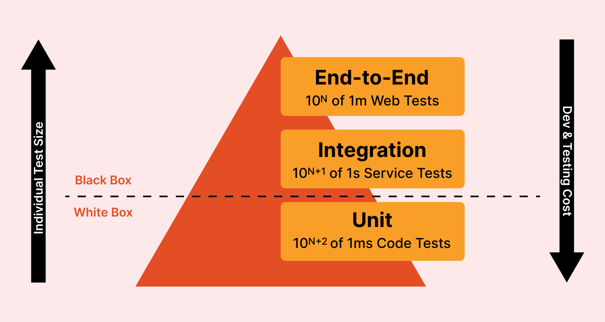

# Software Testing

---

## Table of Contents

- [Foundations of Testing](#foundations-of-testing)
  - [Test Case & Test Suite](#test-case--test-suite)
  - [Types of Test Activities](#types-of-test-activities)
- [Software Testing Life Cycle (STLC)](#software-testing-life-cycle-stlc)
  - [Requirements Analysis](#requirements-analysis)
  - [Test Planning](#test-planning)
  - [Test Case Development](#test-case-development)
  - [Environment Setup](#environment-setup)
  - [Test Execution](#test-execution)
  - [Test Cycle Closure](#test-cycle-closure)
- [Unit Testing](#unit-testing)
  - [Characteristics](#characteristics)
  - [What to test?](#what-to-test)
  - [When to test?](#when-to-test)
- [JUnit](#junit)
  - [Terminology](#terminology)
  - [JUnit Test Class](#junit-test-class)
  - [JUnit Test Suite](#junit-test-suite)
  - [JUnit Test Runner](#junit-test-runner)
  - [JUnit 5](#junit-5)
  - [Annotations](#annotations)
  - [Ignoring a Test](#ignoring-a-test)
  - [Timeouts](#timeouts)
  - [Expected Exceptions](#expected-exceptions)
  - [Data Driven Testing](#data-driven-testing)
- [Dependencies Using Doubles](#dependencies-using-doubles)
  - [Stubs](#stubs)
  - [Test Lifecycle with Stubs](#test-lifecycle-with-stubs)
  - [Mocks](#mocks)
  - [Test Lifecycle with Mocks](#test-lifecycle-with-mocks)
  - [Mockito](#mockito)

---

## Foundations of Testing



Software testing are the techniques to execute programs with the intent of finding as many defects as possible and/or gaining sufficient confidence in the software system under test.

### Test Case & Test Suite

- **Test Case**: Is a set of inputs and the expected outputs for a system under test.
- **Test Suite**: Is a set of test cases.

Without the expected outputs, a test case is not complete.

- **Direct Input Variable**: A variable that controls the operation directly. Example: arguments, entered data, selection menu, etc.
- **Indirect Input Variable**: A variable that only influences the operations or its effects are propagated to the operation. Example: traffic load, environment variables, etc.

### Types of Test Activities

- **Test-Case Design - Exploratory (human-based)**: Design test values based on domain knowledge of the program and human knowledge of testing, exploratory testing.
- **Test-Case Design - Criteria-based**: Design test values to satisfy coverage or other engineering goal.
- **Test-Case Automation**: Embed test values into executable scripts.
- **Test-Case Execution**: Run tests on the software and record the results.
- **Test-Case Evaluation**: Evaluate the results of the testing, report to developers.

---

## Software Testing Life Cycle (STLC)


- Requirement Analysis
- Test Planning
- Test Case Development
- Environment Setup
- Test Execution
- Test Cycle Closure

#### Requirements Analysis

The process of analyzing the requirements from testing point of view to identify the testable requirements.

Requirements could be either:

- **Functional**: Defining system software must do.
- **Non-Functional**: Defining system performance, security, availability, etc.

#### Test Planning

The process of defining the test strategy, test objectives, test estimation, test deliverables, test schedule, and test environment setup.

#### Test Case Development

The process of developing test cases based on the test basis.

#### Environment Setup

The process of setting up the test environment to execute the test cases.

#### Test Execution

The process of executing the test cases and recording the results.

#### Test Cycle Closure

The process of analyzing the test results, test logs, test reports, and test metrics obtained from the test execution phase to identify the test closure criteria.

---

## Unit Testing

Ensure that each unit (i.e. subsystem, class or method) in isolation has been implemented correctly. Each method looks for a particular result and passes/fails. Often based on `white-box` testing.

### Characteristics

- A unit test must only test one specific unit of functionality (i.e class or method).
- It is fast to execute.
- It does not access a database or a file system.
- It does not communicate via a network.
- It does not require any special set up to the system environment such as modifying a configuration file.
- It leaves the system and the system environment in the same state that it had prior to the test.
- Focus on developed components only.

### What to test?

- Focus on developed components and surroundings
- One sample form each equivalent class of input data
- Invalid data
- Boundaries

### When to test?

- **Waterfall**: Typically written as the system has been developed.
- **TDD**: Each unit test is written before or during the corresponding code being written.

### Best Practices

- Each test should test one thing only.
- Each test method should have few assert statements.

## JUnit


- Java testing framework used to write and run tests
- Open source
- Helps test execution automation

### Terminology

- **Test Drivers**: Modules that act as temporary replacement for a calling module and give the same output as that of the actual product.
- **Test Execution**: The execution of an individual unit test procedure.

```java
@BeforeEach // Optional (setup)

@Test // Required (test case)

@AfterEach // Optional (cleanup)
```

- **Test Result Formatter**: A test runner produces results in once or more output formats, e.i. text, XML, HTML, etc.
- **Assertions**: An assertion is a function or macro that verifies the behavior (or state) of the unit under test.

```java
import static org.junit.Assert.*; // Import all static assert methods

public class TestClass {
  @Test
  public void testMethod() {
    assertEquals(1, 1);           // Compare two values
    assertNotEquals(1, 2);        // Compare two values
    assertTrue(true);             // Check if true
    assertFalse(false);           // Check if false
    assertNull(null);             // Check if null
    assertNotNull(1);             // Check if not null
    assertSame(1, 2);             // Check if object is same
    assertNotSame(1, 1.5);        // Check if object not same
    fail("Not yet implemented");  // Fail test
  }
}
```

### JUnit Test Class

- A method with `@Test` is flagged as JUnit test case.
- All `@Test` methods run when JUnit runs your test class.

```java
import org.junit.Test;

public class TestClass {
  @Test
  public void testMethod() {
    // Test method
  }
}
```

### JUnit Test Suite

- A test suite is a collection of test cases.
- The suite construction is done by using `@RunWith` and `@Suite` annotations.

```java
package com.example.tests; // Optional for running tests in command line

import org.junit.runner.RunWith;
import org.junit.runners.Suite;

@RunWith(Suite.class)
@Suite.SuiteClasses({
  TestClass1.class,
  TestClass2.class
})

public class TestSuite {}
```

### JUnit Test Runner

- Create a java class file named `TestRunner.java`.
- Compile all the java classes using `javac` compiler.
- Run the `TestRunner` class using `java` command.

```java
import org.junit.runner.JUnitCore;
import org.junit.runner.Result;
import org.junit.runner.notification.Failure;

public class TestRunner {
  public static void main(String[] args) {
    Result result = JUnitCore.runClasses(TestSuite.class);

    for (Failure failure : result.getFailures()) {
      System.out.println(failure.toString());
    }

    System.out.println(result.wasSuccessful());
  }
}
```

### JUnit 5

```java
import static org.junit.Assert.*;

import org.junit.Before;
import org.junit.After;
import org.junit.Test;

public class TestClass {
  Tournament tournament;

  @BeforeEach // Optional (setup)
  public void before() throws Exception {
    System.out.println("Before");
    tournament = new Tournament(100, 60);
  }

  @Test // Required (test case)
  public void testGetBestTeam() {
    assertNotNull(tournament);

    Team team = tournament.getBestTeam();
    assertNotNull(team);
    assertEquals(100, team.getPoints());
  }

  @AfterEach // Optional (cleanup)
  public void after() throws Exception {
    System.out.println("After");
    tournament = null;
  }
}
```

### Annotations

Additional annotations for JUnit 5.


### Ignoring a Test

Use `@Ignore` annotation to ignore a test.

```java
import org.junit.Disabled;

@Disabled("Disabled until bug #99 has been fixed")
@Test
public void testMethod() {
  // Test method to be ignored
}
```

### Timeouts

Use `timeout` parameter added to `@Test` annotation, with timeout parameter you can specify a value (in milliseconds) that you expect to be the upper limit of the time you spend executing your test.

```java
import org.junit.Test;

@Test(timeout = 1000) // 1000 milliseconds
public void testTimeout() {
  // Test method
}
```

### Expected Exceptions

To catch (expected) exceptions thrown by JUnit tests, use `@Test` annotation's `expected` parameter.

```java
import org.junit.Test;

@Test(expected = NotFoundException.class)
public void testNotFoundException() throws NotFoundException {
  // Test method
}
```

### Data Driven Testing

Data driven unit tests call a constructor for each collection of test values.

```java
import org.junit.Test;
import org.junit.runner.RunWith;
import org.junit.runners.Parameterized;
import org.junit.runners.Parameterized.Parameters;
import static org.junit.Assert.assertTrue;

@RunWith(Parameterized.class) // Parameterized test runner
public class TestClass {
  private int a;
  private int b;
  private int sum;

  // Constructor
  public TestClass(int a, int b, int sum) {
    this.a = a;
    this.b = b;
    this.sum = sum;
  }

  @Parameters // Creating the set of test values
  public static Collection<Object[]> parameters() {
    return Arrays.asList(new Object[][] {
      { 1, 1, 2 },  // Test 1
      { 2, 2, 4 },  // Test 2
      { 3, 2, 5 },  // Test 3
      { 4, 3, 7 },  // Test 4
      { 5, 3, 8 }   // Test 5
    });
  }

  @BeforeAll // Setup
  public static void setUpCalculator() throws Exception {
    calculator = new Calculator();
  }

  @Test // Test case
  public void testAdd() {
    assertTrue("Addition Test", this.sum == calculator.add(this.a, this.b));
  }

  @AfterAll // Cleanup
  public static void tearDownCalculator() throws Exception {
    calculator = null;
  }
}
```

---

## Dependencies Using Doubles


- Typically SUT (system under test) has dependencies.
- Unit tests should not have dependencies.
- If the SUT collaborates with any others classes, those classes are referred to as `depended on components` (DOC).
- A test double is a replacement for a DOC.

Example:

1. A system might send an email to a user.
2. Since we do not want to send an email to a user every time we run a test, we use a test double to replace the email sending component.
3. We want to verify that the system sends an email to the user.

**NOTE**: External dependencies _MUST_ be removed from unit testing.

### Stubs

- Is a fake class that comes with preprogrammed return values
- It's injected into the class under test to give control over what's being tested as input.
- Supplies responses to requests from the SUT.

Example:

- A database connection that allows you to mimic any connection scenario without having s real database.

### Test Lifecycle with Stubs

1. **Setup**: Prepare SUT that is being tested and its stubs collaborators. Usually in `@BeforeAll` method.
2. **Exercise**: Test the functionality. Usually in `@Test` method.
3. **Verify State**: Use asserts to check object's state.
4. **Teardown**: Clean up resources. Unsually in `@AfterAll` method.

### Mocks

- A fake object that decides whether a test has passed or failed by watching interactions between objects.
- Dummy implementation of an interface or class in Mock framework.
- Needed when a unit of code under test depends upon an external object.

Example:

- You can ask it whether a method was called or how many times it was called. Typically mocks are classes with side effects that need to be examined.

### Test Lifecycle with Mocks

1. **Setup Data**: Prepare object that is being tested.
2. **Setup Expectations**: Prepare expectations in mock that is being used by primary object.
3. **Exercise**: Test the functionality.
4. **Verify Expectations**: Verify that correct methods have been invoked in mocks.
5. **Teardown**: Clean up resources.

### Mockito

- Is a mocking framework for Java.
- Auto-generation of mock objects that implement a given interface.
- Logging of what calls are made to the mock objects.

```java
// GradesService.java

public class GradesService {
  private final Gradebook gradebook;

  public GradesService(Gradebook gradebook) {
    this.gradebook = gradebook;
  }

  Double averageGrades(Student student) {
    return average(gradebook.gradesFor(student));
  }
}

```

```java
// GradesServiceTest.java

import static org.mockito.Mockito.*;
import static org.junit.Assert.*;
import org.junit.*;

public class GradesServiceTest {
  private Gradebook gradebook;
  private Student student;

  @BeforeAll // Setup
  public static void setUp() {
    this.gradebook = mock(Gradebook.class);
    this.student = new Student();
  }

  @Test // Test case
  public void testAverageGrades() {
    when(gradebook.gradesFor(student)).thenReturn(grades(9.0, 8.0, 7.0));

    GradesService gradesService = new GradesService(this.gradebook);
    Double average = gradesService.averageGrades(this.student);

    assertEquals(8.0, average);
  }

  @AfterAll // Cleanup
  public static void cleanUp() {
    this.gradebook = null;
    this.student = null;
  }
}
```

- `mock()` method takes a class or an interface as an argument and creates a mock object of given class or interface.
- `when()` method takes a method call on mock object as an argument and defines return value for that method call.
- `thenReturn()` method defines return value for the method call. If you specify more than one value, they will be returned in sequence until the last one is used.

---

## Black Box Testing


Black Box testing applies at all granularity levels of testing.

- **Unit Testing**: From module interface specification.

- **Integration Testing**: From the API or subsystem specification.

- **System Testing**: From the system specification.

- **Regression Testing**: From system requirements + bug history.

### Equivalent Class Testing (ECT)

- You divide the set into partition that can be considered the same.

- Partitions of input space in such a way that input data have the same effect on the system.

- They all test the same unit (method, class, etc).

- Entire input set is covered by the test cases.

- They entire set of inputs can be divided into `Expected (E)` and `Unexpected (U)` inputs.

### Weak / Strong ECT

- **Weak Equivalence Class Testing (one-dimensional)**: Choosing one variable value form each equivalence class (one A, B, and C) such that all classes are covered.

`max(|A|, |B|, |C|)`

Example:

- A = {1, 2, 3, 4}
- B = {5, 6}
- C = {7, 8, 9}

max(4, 2, 3) = 4

- **Strong Equivalence Class Testing (multi-dimensional)**: Based on the Cartesian product of the partition subsets (A x B x C). Testing all interactions of all equivalence classes.

`|A| x |B| x |C|`

Example:

- A = {1, 2, 3, 4}
- B = {5, 6}
- C = {7, 8, 9}

4 x 2 x 3 = 24

### Boundary Value Testing (BVT)
